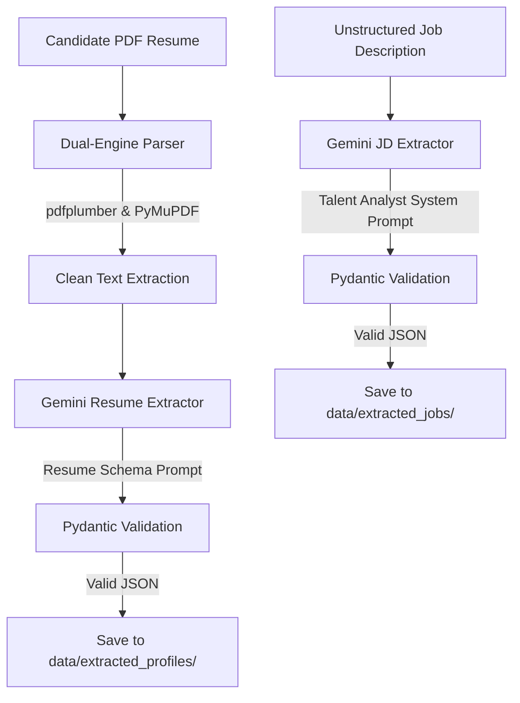

# AI Recruitment Intelligence System (ARIS)

A production-ready Python parser and AI-driven intelligence system for recruiting operations. It handles two core pipelines:
1. **Resume Processing**: Automatically extracts and cleans text from PDF resumes, processes the unstructured text using Google Gemini Large Language Models, validates the output against strict Pydantic schemas, and saves structured candidate profiles as pretty-printed JSON files.
2. **Job Description Intelligence**: Transforms unstructured Job Descriptions (JDs) into structured hiring profiles using the Gemini API, identifying both explicit requirements and implicit hiring signals, and persisting them as validated JSON files.

---

## Table of Contents
- [Features](#features)
- [System Architecture](#system-architecture)
- [Project Directory Structure](#project-directory-structure)
- [Setup & Installation](#setup--installation)
  - [1. Create Virtual Environment](#1-create-virtual-environment)
  - [2. Activate Virtual Environment](#2-activate-virtual-environment)
  - [3. Install Dependencies](#3-install-dependencies)
  - [4. Environment Variables](#4-environment-variables)
- [Usage & Execution Workflows](#usage--execution-workflows)
  - [Running the Dual-Engine PDF Text Parser](#running-the-dual-engine-pdf-text-parser)
  - [Running the AI Resume Extractor](#running-the-ai-resume-extractor)
  - [Running the Job Description Intelligence Engine](#running-the-job-description-intelligence-engine)
- [Structured Profiles Data Schema](#structured-profiles-data-schema)
  - [Candidate Resume Schema](#candidate-resume-schema)
  - [Hiring Job Profile Schema](#hiring-job-profile-schema)
- [Advanced Extraction Quality Rules](#advanced-extraction-quality-rules)
- [Error Handling & Custom Exceptions](#error-handling--custom-exceptions)
- [Running Unit Tests](#running-unit-tests)

---

## Features

- **Dual-Engine PDF Parsing**: Utilizes `pdfplumber` and `PyMuPDF (fitz)` concurrently to extract raw text, applying layout-preserving text cleaning to strip excess white spaces and preserve structural alignments (headings, bullets).
- **Quality Metric Comparison**: Compares extraction results from both PDF engines using an alphanumeric-to-character ratio density score to select the cleanest, highest-quality textual representation.
- **LLM-Powered Information Extraction**: Integrates with the Google Gemini API (supporting `gemini-2.5-flash` or custom models) using precise system instructions to parse unstructured texts into formatted JSON.
- **Job Description Intelligence**: Translates vague/unstructured job descriptions into deep hiring profiles mapping mandatory/preferred skills, leadership indicators, domains, soft skills, seniority levels, complexity scores, and future potential indicators.
- **Strict Data Validation**: Leverages `Pydantic` v2 to validate extracted JSON data against standard schemas, filtering out formatting issues or invalid data structures.
- **Normalized Persistence & Storage**: Sanitizes candidate and role names, writing pretty-printed JSON profiles to their respective folders inside `data/`.
- **Comprehensive Logging**: Tracks validation workflows, API requests, execution status, and warning states in both console output and `logs/resume_parser.log`.

---

## System Architecture

ARIS provides twin pipelines to convert unstructured PDFs and text JDs into structured intelligence assets:



---

## Project Directory Structure

```text
AI-RECRUITMENT-MODEL/
├── app/
│   ├── extractors/
│   │   ├── job_extractor.py                 # Job Description LLM Extraction Service
│   │   └── resume_information_extractor.py  # Resume LLM Extraction Service
│   ├── models/
│   │   ├── job_schema.py                    # Pydantic schemas (JobProfile)
│   │   └── resume_schema.py                 # Pydantic schemas (ResumeProfile)
│   ├── parsers/
│   │   └── resume_parser.py                 # Dual-Engine text parser (pdfplumber/PyMuPDF)
│   ├── prompts/
│   │   ├── job_prompt.py                    # System & User prompts for Job Description LLM
│   │   └── extraction_prompt.py             # System & User prompts for Resume LLM
│   ├── storage/
│   │   ├── job_storage.py                   # Persistent storage for job profiles
│   │   └── profile_storage.py               # Persistent storage for candidate profiles
│   ├── config.py                            # Environment configurations (.env parser)
│   └── main.py                              # Resume parsing entry point CLI demo
├── data/
│   ├── extracted_jobs/                      # Saved job profile JSON documents
│   └── extracted_profiles/                  # Saved candidate profile JSON documents
├── logs/
│   └── resume_parser.log                    # Local execution logs
├── sample_jds/
│   ├── nishant_jd.txt                       # Razorpay Chief of Staff / AI Builder JD
│   └── senior_software_engineer.txt         # Senior Software Engineer JD
├── sample_resumes/
│   ├── resume.pdf                           # Default sample resume
│   └── resume1.pdf                          # Secondary sample resume
├── tests/
│   ├── test_information_extractor.py        # Resume extractor unit tests
│   ├── test_job_extractor.py                # Job extractor unit tests
│   └── test_resume_parser.py                # Parser layout & error handling unit tests
├── .env                                     # Local environment file (API keys)
├── .env.example                             # Environment variable template
├── .gitignore                               # Git ignored files & dirs (.venv, logs, etc.)
├── parsed_resume.txt                        # Output file from text parsing run
├── requirements.txt                         # Python packages & dependencies
├── test_information_extraction.py           # Standalone LLM resume extraction run script
├── test_job_extraction.py                   # Standalone LLM job extraction run script
├── test_resume.py                           # Standalone parser run script
└── README.md                                # Project documentation
```

---

## Setup & Installation

### 1. Create Virtual Environment
Ensure you have Python 3.8+ installed. Initialize a clean virtual environment named `.venv`:
```powershell
python -m venv .venv
```

### 2. Activate Virtual Environment
Activate the environment based on your operating system:
- **Windows (PowerShell)**:
  ```powershell
  .venv\Scripts\Activate.ps1
  ```
- **Windows (Command Prompt)**:
  ```cmd
  .venv\Scripts\activate.bat
  ```
- **macOS/Linux**:
  ```bash
  source .venv/bin/activate
  ```

### 3. Install Dependencies
Install all required packages from `requirements.txt`:
```bash
pip install -r requirements.txt
```

### 4. Environment Variables
Copy `.env.example` to create your local `.env` configuration:
```powershell
copy .env.example .env
```
Open `.env` and fill in your Gemini API credentials:
```env
GEMINI_API_KEY=your_gemini_api_key_here
GEMINI_MODEL=gemini-2.5-flash
```

---

## Usage & Execution Workflows

### Running the Dual-Engine PDF Text Parser

You can execute the text parsing component via two methods:

#### Method A: Demo CLI Program
Run the parser on the default sample resume or supply a custom PDF file:
```bash
# Run on default sample resume
python app/main.py

# Run on a custom resume PDF
python app/main.py path/to/your_resume.pdf
```

#### Method B: Standalone Run Script
Run the basic parser which outputs the raw extracted text into `parsed_resume.txt`:
```bash
python test_resume.py
```

---

### Running the AI Resume Extractor

The resume extractor reads a parsed resume text, invokes the Gemini API to extract candidate fields, validates the response schema, and saves the output JSON file.

To run the complete candidate extraction pipeline:
```bash
python test_information_extraction.py
```

#### Expected Candidate Extraction Pipeline Sequence:
1. **Reads** text from `parsed_resume.txt` (if missing, it automatically generates it from `sample_resumes/resume1.pdf`).
2. **Submits** text to Gemini with System Instructions.
3. **Receives & Sanitizes** JSON response (strips any markdown code fences).
4. **Validates** data structure via Pydantic model (`ResumeProfile`).
5. **Saves** file naming to `data/extracted_profiles/` (e.g. `john_doe.json`).

---

### Running the Job Description Intelligence Engine

The Job Description (JD) Intelligence Engine reads an unstructured JD text file, analyzes it via Gemini to extract explicit/implicit roles and hidden signals, validates the structure, and outputs a formatted JSON file.

To run the complete job description extraction pipeline:
```bash
python test_job_extraction.py
```

#### Expected Job Extraction Pipeline Sequence:
1. **Reads** raw job description text from `sample_jds/nishant_jd.txt`.
2. **Submits** text to Gemini with specialized Talent Analyst Instructions and Advanced Quality Rules.
3. **Validates** JSON parameters via Pydantic model (`JobProfile`).
4. **Saves** sanitized file to `data/extracted_jobs/` (e.g. `senior_software_engineer.json`).

---

## Structured Profiles Data Schema

### Candidate Resume Schema
Defined in [resume_schema.py](file:///e:/AI%20Recruitment%20Model/app/models/resume_schema.py):
- **`Skill`**: `name`
- **`Experience`**: `role`, `company`, `start_date`, `end_date`, `duration`, `description`
- **`Project`**: `name`, `technologies`, `description`
- **`Certification`**: `name`, `issuer`, `year`
- **`Education`**: `degree`, `institution`, `field`, `graduation_year`
- **`ResumeProfile`**: Encompasses name, skills, experience list, projects list, education, certifications, and achievements.

### Hiring Job Profile Schema
Defined in [job_schema.py](file:///e:/AI%20Recruitment%20Model/app/models/job_schema.py):
- **`EducationRequirement`**: `degree` (degree type, e.g. B.Tech), `field` (major, e.g. Computer Science).
- **`HiddenHiringSignals`**: `autonomy_required`, `client_facing`, `research_oriented`, `innovation_focused`, `startup_environment`, `high_ownership`.
- **`JobProfile`**: 
  - `required_skills`: List of mandatory skills.
  - `preferred_skills`: List of nice-to-have skills.
  - `critical_skills`: Ordered list of top 5 skills.
  - `experience_required`: Minimum years of experience.
  - `education`: Required degree details.
  - `leadership`: Whether the role demands leadership/management.
  - `seniority_level`: entry, junior, mid, senior, lead, manager, director.
  - `responsibility_themes`: Key job themes (limit to 10).
  - `domain_knowledge`: Domain/industry expertise (e.g. FinTech).
  - `soft_skills`: Identified or strongly implied soft skills.
  - `tools_and_technologies`: Developer environments, platforms, databases, libraries.
  - `hidden_hiring_signals`: Inferred operational style signals.
  - `role_complexity_score`: Numeric difficulty index from 1 to 10.
  - `future_potential_signals`: growth traits (willingness to learn, adaptability).
  - `job_summary`: Brief role objective description.

---

## Advanced Extraction Quality Rules

The Job Description Intelligence Engine enforces advanced validation heuristics to improve data quality:
- **Evidence-Based Extraction**: Limits extraction to items explicitly supported by the JD text. Non-evident properties are initialized to `null`, `[]`, or `false` (no hallucinations).
- **Entity Normalization**: Standardizes technology and programming language terms to normalized industry names (e.g. `JS` to `JavaScript`, `K8s` to `Kubernetes`).
- **Deduplication**: Filters out semantic duplicates and aliases from arrays (e.g. merging `communication skills` and `communication` into `Communication`).
- **Prioritization Rules**: Orders `critical_skills` prioritizing mandatory requirements over preferred/bonus skills.
- **Consistency Verification**: Ensures `critical_skills` exist in required/preferred/tech lists, complexity score aligns with the seniority level, and leadership properties contain contextual evidence.

---

## Error Handling & Custom Exceptions

The system implements granular validation checks across all stages, raising explicit exceptions:

### Parser Exceptions ([file_utils.py](file:///e:/AI%20Recruitment%20Model/app/utils/file_utils.py))
- `ResumeParserError`: Base class for parser-related issues.
- `FileNotFoundError`, `ValueError`, `CorruptedPDFError`, `EmptyPDFError`, `EncryptedPDFError`.

### Resume Extractor Exceptions ([resume_information_extractor.py](file:///e:/AI%20Recruitment%20Model/app/extractors/resume_information_extractor.py))
- `ResumeExtractorError`: Base class for candidate extraction.
- `EmptyResumeTextError`, `MissingAPIKeyError`, `GeminiAPIError`, `InvalidJSONResponseError`, `ProfileValidationError`.

### Job Extractor Exceptions ([job_extractor.py](file:///e:/AI%20Recruitment%20Model/app/extractors/job_extractor.py))
- `JobExtractorError`: Base class for job description extraction.
- `EmptyJobTextError`: Raised if the input JD text is empty.
- `MissingAPIKeyError`: Raised if `GEMINI_API_KEY` is not set.
- `GeminiAPIError`: Raised if Gemini client calls fail.
- `InvalidJSONResponseError`: Raised if the model fails to return standard JSON.
- `ProfileValidationError`: Raised if Pydantic model validation fails against the schema.

---

## Running Unit Tests

The test suite contains unit tests covering engine cleaning, mock API scenarios, validation failures, and PDF edge cases.

To run all unit tests:
```bash
# General command
pytest -v

# Windows environment explicit execution
.venv\Scripts\python.exe -m pytest -v
```
