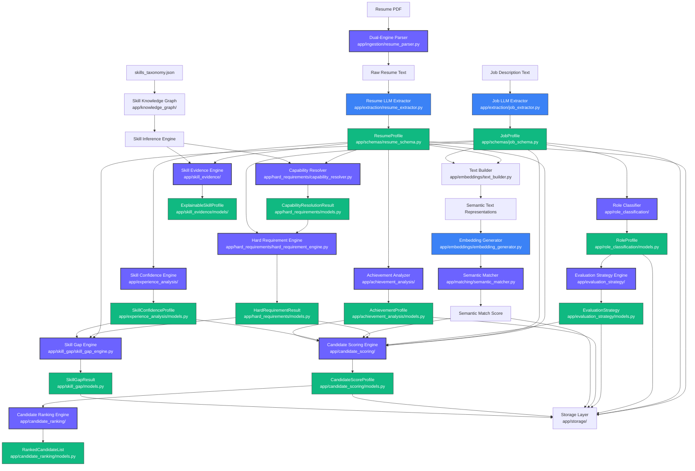

# AI Recruitment Intelligence System (ARIS)

ARIS is a production-ready, modular, and extensible AI-driven recruitment intelligence system. The platform transforms unstructured PDF resumes and raw job descriptions into structured intelligence assets, classifies roles into predefined industry taxonomies, generates dynamic evaluation strategies, constructs semantic evidence profiles, computes candidate experience signals, checks strict hard requirement compliance, detects exceptional standout achievements, and scores vector matches.

All components are wired into a central pipeline orchestrator, accessible through modular standalone engine APIs, or served via a FastAPI REST API with a companion React frontend web app.

---

## Table of Contents
- [Quick Start](#quick-start)
- [Prerequisites](#prerequisites)
- [Platform Core Engines](#platform-core-engines)
  - [1. Dual-Engine PDF Ingestion](#1-dual-engine-pdf-ingestion)
  - [2. Pydantic-Schema LLM Extraction](#2-pydantic-schema-llm-extraction)
  - [3. Role Classification Engine](#3-role-classification-engine)
  - [4. Evaluation Strategy Engine](#4-evaluation-strategy-engine)
  - [5. Skill Knowledge Graph & Inference](#5-skill-knowledge-graph--inference)
  - [6. Skill Evidence Engine](#6-skill-evidence-engine)
  - [7. Experience Analysis & Skill Confidence Engine](#7-experience-analysis--skill-confidence-engine)
  - [8. Hard Requirements Compliance Engine](#8-hard-requirements-compliance-engine)
  - [9. Standout Achievement Analyzer](#9-standout-achievement-analyzer)
  - [10. Semantic Matching & Embeddings](#10-semantic-matching--embeddings)
  - [11. Candidate Scoring Engine](#11-candidate-scoring-engine)
  - [12. Candidate Ranking Engine](#12-candidate-ranking-engine)
  - [13. Skill Gap Engine](#13-skill-gap-engine)
- [System Architecture](#system-architecture)
- [Pipeline Stages](#pipeline-stages)
- [Project Directory Structure](#project-directory-structure)
- [Setup & Installation](#setup--installation)
- [Usage Instructions](#usage-instructions)
  - [Full Pipeline via Orchestrator](#full-pipeline-via-orchestrator)
  - [Standalone Evaluation Strategy Engine](#standalone-evaluation-strategy-engine)
  - [Standalone Achievement Analyzer](#standalone-achievement-analyzer)
  - [Standalone Hard Requirements Compliance Engine](#standalone-hard-requirements-compliance-engine)
  - [Standalone Skill Confidence Engine](#standalone-skill-confidence-engine)
  - [Standalone Skill Gap Engine](#standalone-skill-gap-engine)
  - [Standalone Candidate Scoring Engine](#standalone-candidate-scoring-engine)
  - [Standalone Candidate Ranking Engine](#standalone-candidate-ranking-engine)
  - [Individual Stage Run Scripts](#individual-stage-run-scripts)
  - [Phase 3 Validation Suite](#phase-3-validation-suite)
  - [FastAPI Web API](#fastapi-web-api)
  - [React Frontend Client](#react-frontend-client)
- [Data Schemas](#data-schemas)
  - [Resume Profile](#resume-profile)
  - [Job Profile](#job-profile)
  - [Role Profile](#role-profile)
  - [Evaluation Strategy](#evaluation-strategy)
  - [Capability Resolution Result](#capability-resolution-result)
  - [Hard Requirements Compliance Result](#hard-requirements-compliance-result)
  - [Skill Gap Result](#skill-gap-result)
  - [Achievement Profile](#achievement-profile)
  - [Candidate Score Profile](#candidate-score-profile)
  - [Ranked Candidate List](#ranked-candidate-list)
- [Extraction Quality & Prevention Rules](#extraction-quality--prevention-rules)
- [Custom Exception Hierarchy](#custom-exception-hierarchy)
- [Running Tests](#running-tests)
- [Project Roadmap](#project-roadmap)
- [Troubleshooting](#troubleshooting)

---

## Quick Start

Run all commands from the **project root** (`AI-RECRUITMENT-MODEL/`).

```bash
# 1. Activate the workspace virtual environment (which is in the parent workspace directory)
source ../.venv/bin/activate             # macOS / Linux
# ..\.venv\Scripts\activate              # Windows

# 2. Configure your environment variables (.env file)
# Create a .env file in the project root containing: GEMINI_API_KEY=your_key_here

# 3. Run the orchestrator with sample inputs
python scripts/run_full_pipeline.py
```

On first run, the local embedding model (`sentence-transformers/all-mpnet-base-v2`) is downloaded automatically. Subsequent runs are fully cached and take under 10 seconds.

---

## Prerequisites

| Requirement | Details |
|:---|:---|
| **Python** | 3.10 or newer recommended. (Python 3.9+ is supported). |
| **Gemini API Key** | Required for structured profile extraction. Obtain one from the [Google AI Studio](https://aistudio.google.com/apikey). |
| **Dependencies** | Listed in [requirements.txt](file:///Users/navinprasad/aris/AI-RECRUITMENT-MODEL/requirements.txt) including `pdfplumber`, `PyMuPDF (fitz)`, `pydantic`, `sentence-transformers`, `scikit-learn`, `networkx`, and `pytest`. |

---

## Platform Core Engines

### 1. Dual-Engine PDF Ingestion
Located in [resume_parser.py](file:///Users/navinprasad/aris/AI-RECRUITMENT-MODEL/app/ingestion/resume_parser.py). It executes two parsers (`pdfplumber` and `PyMuPDF / fitz`) concurrently. It computes an alphanumeric-to-character density score for each output and retains the cleaner document structure. It handles corrupted, password-protected, and blank documents gracefully with tailored exceptions.

### 2. Pydantic-Schema LLM Extraction
Located in the [extraction](file:///Users/navinprasad/aris/AI-RECRUITMENT-MODEL/app/extraction) folder. Using Google Gemini (`gemini-2.5-flash`), it parses unstructured text into structured, typed payloads. The outputs are validated against strict contracts in [schemas](file:///Users/navinprasad/aris/AI-RECRUITMENT-MODEL/app/schemas) folder ensuring fields match explicit facts or supported inferences.

### 3. Role Classification Engine
Located in the [role_classification](file:///Users/navinprasad/aris/AI-RECRUITMENT-MODEL/app/role_classification) folder. It evaluates job description requirements against heuristic matrices in [role_rules.py](file:///Users/navinprasad/aris/AI-RECRUITMENT-MODEL/app/role_classification/role_rules.py). It classifies roles into standard Role Families (e.g. `software_engineering`, `data_ai`), specializations (e.g. `backend_engineer`, `ml_engineer`), and seniority levels (`junior`, `mid_level`, `senior`, `staff`).

### 4. Evaluation Strategy Engine
Located in the [evaluation_strategy](file:///Users/navinprasad/aris/AI-RECRUITMENT-MODEL/app/evaluation_strategy) folder. Generates role-aware evaluation weights, strictness levels, minimum skill confidence thresholds, and requirement tolerance values matching the classified `RoleProfile`. Predefined configurations exist for roles like `intern_backend`, `new_grad_backend`, `mid_backend`, `senior_backend`, `intern_ml`, `mid_ml`, and `senior_ml`. It handles unknown profiles through dynamic seniority and specialization fallback logic defined in [strategy_engine.py](file:///Users/navinprasad/aris/AI-RECRUITMENT-MODEL/app/evaluation_strategy/strategy_engine.py).

### 5. Skill Knowledge Graph & Inference
Located in the [knowledge_graph](file:///Users/navinprasad/aris/AI-RECRUITMENT-MODEL/app/knowledge_graph) folder. Loads a skills taxonomy from `data/skill_graph/skills_taxonomy.json` into a `NetworkX` directed graph. It maps relationships (e.g. `FastAPI` -> `requires` -> `Python`). The [skill_inference_engine.py](file:///Users/navinprasad/aris/AI-RECRUITMENT-MODEL/app/knowledge_graph/inference/skill_inference_engine.py) performs ancestral traversal to infer implicit skills.

### 6. Skill Evidence Engine
Located in the [skill_evidence](file:///Users/navinprasad/aris/AI-RECRUITMENT-MODEL/app/skill_evidence) folder. Collects direct mentions, mapped project usages, role references, and graph dependencies for candidate skills. It assigns weighted attributions (Direct: 1.0, Project: 0.8, Dependency: 0.5, Inherited: 0.3) to construct trace chains and qualitative evidence levels (`Expert`, `Strong`, `Moderate`, `Limited`) via the [skill_evidence_engine.py](file:///Users/navinprasad/aris/AI-RECRUITMENT-MODEL/app/skill_evidence/services/skill_evidence_engine.py).

### 7. Experience Analysis & Skill Confidence Engine
Located in the [experience_analysis](file:///Users/navinprasad/aris/AI-RECRUITMENT-MODEL/app/experience_analysis) folder. Calculates job complexity scores based on duration and projects. It combines direct evidence, role descriptions, and project tenures to compute numerical confidence scores (0-100) and confidence tiers using the orchestrator class [SkillConfidenceEngine](file:///Users/navinprasad/aris/AI-RECRUITMENT-MODEL/app/experience_analysis/skill_confidence_engine.py).

### 8. Hard Requirements Compliance Engine
Located in the [hard_requirements](file:///Users/navinprasad/aris/AI-RECRUITMENT-MODEL/app/hard_requirements) folder. Resolves candidate raw skills using [capability_resolver.py](file:///Users/navinprasad/aris/AI-RECRUITMENT-MODEL/app/hard_requirements/capability_resolver.py) which expands candidate capabilities with inferred ancestors from the Skill Knowledge Graph. Then, [hard_requirement_engine.py](file:///Users/navinprasad/aris/AI-RECRUITMENT-MODEL/app/hard_requirements/hard_requirement_engine.py) strictly matches resolved capabilities against job criteria to return pass status, coverage score, matched/missing requirements, and granular decision reasons.

### 9. Standout Achievement Analyzer
Located in the [achievement_analysis](file:///Users/navinprasad/aris/AI-RECRUITMENT-MODEL/app/achievement_analysis) folder. Scans the candidate's `ResumeProfile` using sentence-level regex patterns defined in [achievement_detector.py](file:///Users/navinprasad/aris/AI-RECRUITMENT-MODEL/app/achievement_analysis/achievement_detector.py) to identify standout signals across 5 core dimensions: Academic (e.g., JEE AIR ranks, top universities, scholarships), Technical (e.g., hackathon wins, CP ratings, open-source), Research (e.g., papers, patents), Leadership (e.g., club leaders, mentors, EM/lead roles), and Entrepreneurship (e.g., founders, YC experience, product ownership). It scores categories, compiles a consolidated overall score (using a max-biased formula favoring standout spikes) in [scoring.py](file:///Users/navinprasad/aris/AI-RECRUITMENT-MODEL/app/achievement_analysis/scoring.py), and provides explanation traces.

### 10. Semantic Matching & Embeddings
Located in the [matching](file:///Users/navinprasad/aris/AI-RECRUITMENT-MODEL/app/matching) and [embeddings](file:///Users/navinprasad/aris/AI-RECRUITMENT-MODEL/app/embeddings) folders. Resolves parsed candidate profiles and job criteria into cohesive text structures. It generates vector embeddings locally using `SentenceTransformer` (`all-mpnet-base-v2`) in [embedding_generator.py](file:///Users/navinprasad/aris/AI-RECRUITMENT-MODEL/app/embeddings/embedding_generator.py) and computes cosine similarity match scores in [semantic_matcher.py](file:///Users/navinprasad/aris/AI-RECRUITMENT-MODEL/app/matching/semantic_matcher.py).

### 11. Candidate Scoring Engine
Located in the [candidate_scoring](file:///Users/navinprasad/aris/AI-RECRUITMENT-MODEL/app/candidate_scoring) folder. Combines all candidate evaluation signals (semantic similarity score, skills confidence, experience duration vs. required, standout achievements, project relevance, and leadership) into a unified role-aware candidate score (0.0 to 100.0). It consumes weights defined by the `EvaluationStrategy` for the target role in [scoring_engine.py](file:///Users/navinprasad/aris/AI-RECRUITMENT-MODEL/app/candidate_scoring/scoring_engine.py), ensuring a dynamically parameterized scoring system.

#### Scoring Formulation
The **Overall Candidate Score** is computed as the weighted average of active scoring components:
$$\text{Overall Score} = \text{round}\left( \frac{\sum (S_c \times W_c)}{\sum W_c}, 1 \right)$$
Where:
- $S_c$ is the component score (scaled to $[0.0, 100.0]$).
- $W_c$ is the component weight configured by the target role's `EvaluationStrategy`.

Component scores ($S_c$) are computed as follows:
- **Skill Strength ($S_{skills}$)**: Filters out tool/IDE/editor profiles and calculates the average of the candidate's top $K$ (up to 10) verified skills:
  $$S_{skills} = \text{round}\left( \frac{\sum_{i=1}^{K} \text{confidence\_score}_i}{K}, 1 \right)$$
- **Experience Quality ($S_{experience}$)**: Compares the total parsed candidate experience (in years, where months are scaled by $1/12$) against the job's minimum required experience ($Y_{req}$):
  $$S_{experience} = \text{round}\left( \min\left(100.0, \frac{\text{total\_years}}{\max(1.0, Y_{req})} \times 100.0\right), 1 \right)$$
- **Achievement Impact ($S_{achievements}$)**: Normalizes the raw achievement score ($A_{raw}$, scale $[0.0, 10.0]$) to a percentage:
  $$S_{achievements} = \text{round}\left( \max(0.0, \min(10.0, A_{raw})) \times 10.0, 1 \right)$$
- **Projects Strength ($S_{projects}$)**: Evaluates project quantity and technical alignment. Scores 20 points per project plus 20 points for each project utilizing a required skill:
  $$S_{projects} = \min\left(100.0, (\text{total\_projects} \times 20) + (\text{relevant\_projects} \times 20)\right)$$
- **Leadership Strength ($S_{leadership}$)**: Evaluates lead roles and leadership achievements:
  - If the candidate has held an explicit leadership role (e.g. manager, lead, CTO, founder), $S_{leadership} = 100.0$.
  - Otherwise, scales based on leadership achievements:
    $$S_{leadership} = \min\left(100.0, \text{leadership\_achievements} \times 50.0\right)$$
- **Hard Requirements Compliance ($S_{hard\_requirements}$)**: Derived from the compliance coverage score:
  $$S_{hard\_requirements} = \text{round}\left( \text{coverage\_score} \times 100.0, 1 \right)$$

### 12. Candidate Ranking Engine
Located in the [candidate_ranking](file:///Users/navinprasad/aris/AI-RECRUITMENT-MODEL/app/candidate_ranking) folder. Ranks multiple candidate results deterministically in [ranking_engine.py](file:///Users/navinprasad/aris/AI-RECRUITMENT-MODEL/app/candidate_ranking/ranking_engine.py). It sorts candidates by their overall score (descending) and breaks ties using a strict deterministic priority hierarchy in [tie_breakers.py](file:///Users/navinprasad/aris/AI-RECRUITMENT-MODEL/app/candidate_ranking/tie_breakers.py).

#### Ranking Priority Hierarchy (Deterministic Tie-Breaker)
If two candidates have identical overall scores, the ranking engine evaluates criteria in the following order:
1. **Overall Score** (descending)
2. **Hard Requirements Coverage** (descending)
3. **Semantic Match Score** (descending)
4. **Average Skill Confidence Score** (descending)
5. **Achievement Score** (descending)
6. **Candidate Name** (ascending alphabetical fallback as a strict tie-breaker)

The engine also extracts key **Strengths** (components scoring $\ge 80.0\%$) and **Concerns** (failed compliance or components scoring $< 50.0\%$) for high-level recruiter review.

### 13. Skill Gap Engine
Located in the [skill_gap](file:///Users/navinprasad/aris/AI-RECRUITMENT-MODEL/app/skill_gap) folder. It evaluates candidate capabilities against job profile specifications, identifying missing required/preferred skills, weak skills (confidence score < 50), and strong skills (confidence score >= 75). It generates deterministic, actionable recommendations and computes a unified overall gap score and decision summary.

---

## System Architecture


```mermaid
graph TD
    %% Inputs
    Resume[Resume PDF] --> Ingestion[Dual-Engine Parser\napp/ingestion/resume_parser.py]
    Ingestion --> RawResumeText[Raw Resume Text]
    
    JD[Job Description Text] --> JobExtractor[Job LLM Extractor\napp/extraction/job_extractor.py]
    RawResumeText --> ResumeExtractor[Resume LLM Extractor\napp/extraction/resume_extractor.py]
    
    %% Outputs of Extractor
    ResumeExtractor --> ResumeProfile[ResumeProfile\napp/schemas/resume_schema.py]
    JobExtractor --> JobProfile[JobProfile\napp/schemas/job_schema.py]
    
    %% Classification & Evaluation Strategy
    JobProfile --> RoleClassifier[Role Classifier\napp/role_classification/]
    RoleClassifier --> RoleProfile[RoleProfile\napp/role_classification/models.py]
    RoleProfile --> EvalStrategyEngine[Evaluation Strategy Engine\napp/evaluation_strategy/]
    EvalStrategyEngine --> EvaluationStrategy[EvaluationStrategy\napp/evaluation_strategy/models.py]
    
    %% Knowledge Graph & Inference
    Taxonomy[skills_taxonomy.json] --> Graph[Skill Knowledge Graph\napp/knowledge_graph/]
    Graph --> Inference[Skill Inference Engine]
    
    %% Hard Requirements Matching (Phase 8)
    ResumeProfile --> CapResolver[Capability Resolver\napp/hard_requirements/capability_resolver.py]
    Inference --> CapResolver
    CapResolver --> CapResult[CapabilityResolutionResult\napp/hard_requirements/models.py]
    CapResult --> HardReqEngine[Hard Requirement Engine\napp/hard_requirements/hard_requirement_engine.py]
    JobProfile --> HardReqEngine
    HardReqEngine --> HardReqResult[HardRequirementResult\napp/hard_requirements/models.py]
    
    %% Skill Evidence Engine
    ResumeProfile --> EvidenceEngine[Skill Evidence Engine\napp/skill_evidence/]
    Inference --> EvidenceEngine
    EvidenceEngine --> ExplainableProfile[ExplainableSkillProfile\napp/skill_evidence/models/]
    
    %% Experience Analysis & Skill Confidence Engine
    ResumeProfile --> ConfidenceEngine[Skill Confidence Engine\napp/experience_analysis/]
    ConfidenceEngine --> ConfidenceProfile[SkillConfidenceProfile\napp/experience_analysis/models.py]
    
    %% Achievement Analyzer (Phase 9)
    ResumeProfile --> AchievementAnalyzer[Achievement Analyzer\napp/achievement_analysis/]
    AchievementAnalyzer --> AchievementProfile[AchievementProfile\napp/achievement_analysis/models.py]
    
    %% Semantic Matching
    ResumeProfile --> TextBuilder[Text Builder\napp/embeddings/text_builder.py]
    JobProfile --> TextBuilder
    TextBuilder --> SemanticText[Semantic Text Representations]
    SemanticText --> Embedder[Embedding Generator\napp/embeddings/embedding_generator.py]
    Embedder --> Matcher[Semantic Matcher\napp/matching/semantic_matcher.py]
    Matcher --> SemanticScore[Semantic Match Score]

    %% Candidate Scoring Engine (Phase 10)
    ResumeProfile --> ScoringEngine[Candidate Scoring Engine\napp/candidate_scoring/]
    JobProfile --> ScoringEngine
    EvaluationStrategy --> ScoringEngine
    HardReqResult --> ScoringEngine
    SemanticScore --> ScoringEngine
    ConfidenceProfile --> ScoringEngine
    AchievementProfile --> ScoringEngine
    ScoringEngine --> CandidateScore[CandidateScoreProfile\napp/candidate_scoring/models.py]

    %% Skill Gap Engine (Phase 12)
    JobProfile --> SkillGapEngine[Skill Gap Engine\napp/skill_gap/skill_gap_engine.py]
    HardReqResult --> SkillGapEngine
    ConfidenceProfile --> SkillGapEngine
    SkillGapEngine --> SkillGapResult[SkillGapResult\napp/skill_gap/models.py]

    %% Candidate Ranking Engine (Phase 11)
    CandidateScore --> RankingEngine[Candidate Ranking Engine\napp/candidate_ranking/]
    RankingEngine --> RankedList[RankedCandidateList\napp/candidate_ranking/models.py]
    
    %% Persistence
    ResumeProfile --> Storage[Storage Layer\napp/storage/]
    JobProfile --> Storage
    RoleProfile --> Storage
    EvaluationStrategy --> Storage
    AchievementProfile --> Storage
    SemanticScore --> Storage
    CandidateScore --> Storage
    SkillGapResult --> Storage
    
    %% Formatting
    classDef main fill:#6c63ff,color:#fff,stroke:#333,stroke-width:2px;
    classDef module fill:#3b82f6,color:#fff,stroke:#333,stroke-width:1px;
    classDef data fill:#10b981,color:#fff,stroke:#333,stroke-width:1px;
    
    class Ingestion,RoleClassifier,EvalStrategyEngine,EvidenceEngine,ConfidenceEngine,CapResolver,HardReqEngine,AchievementAnalyzer,Matcher,ScoringEngine,RankingEngine,SkillGapEngine main;
    class ResumeExtractor,JobExtractor,Embedder module;
    class ResumeProfile,JobProfile,RoleProfile,EvaluationStrategy,ExplainableProfile,ConfidenceProfile,AchievementProfile,CapResult,HardReqResult,CandidateScore,RankedList,SkillGapResult data;
```

---

## Pipeline Stages

The central orchestrator in [orchestrator.py](file:///Users/navinprasad/aris/AI-RECRUITMENT-MODEL/app/orchestrator.py) executes the pipeline in sequential stages:

| Stage | Name | Description | Responsible Module |
|:---:|:---|:---|:---|
| **1** | **PDF Ingestion** | Extracts text from PDFs using concurrent dual engines (`pdfplumber` + `PyMuPDF`). | [resume_parser.py](file:///Users/navinprasad/aris/AI-RECRUITMENT-MODEL/app/ingestion/resume_parser.py) |
| **2** | **Resume LLM Extraction** | Extracts structured fields via Gemini and compiles them into a verified Pydantic model. | [resume_extractor.py](file:///Users/navinprasad/aris/AI-RECRUITMENT-MODEL/app/extraction/resume_extractor.py) |
| **3** | **Job LLM Extraction** | Extracts explicit requirements, hidden signals, and complexity metrics from Job Descriptions. | [job_extractor.py](file:///Users/navinprasad/aris/AI-RECRUITMENT-MODEL/app/extraction/job_extractor.py) |
| **4** | **Role Classification** | Evaluates the job profile heuristics to detect role family, specialization, and seniority. | [role_classifier.py](file:///Users/navinprasad/aris/AI-RECRUITMENT-MODEL/app/role_classification/role_classifier.py) |
| **4A** | **Evaluation Strategy** | Generates dynamic weighting strategies based on the classified role context. | [strategy_engine.py](file:///Users/navinprasad/aris/AI-RECRUITMENT-MODEL/app/evaluation_strategy/strategy_engine.py) |
| **5** | **Text Compilation** | Builds detailed, structured semantic text profiles from extracted candidate and job fields. | [text_builder.py](file:///Users/navinprasad/aris/AI-RECRUITMENT-MODEL/app/embeddings/text_builder.py) |
| **6** | **Vector Embedding** | Generates normalized dense vector embeddings using a local SentenceTransformer model. | [embedding_generator.py](file:///Users/navinprasad/aris/AI-RECRUITMENT-MODEL/app/embeddings/embedding_generator.py) |
| **7** | **Semantic Matching** | Computes the cosine similarity between candidate and job profile vector representations. | [semantic_matcher.py](file:///Users/navinprasad/aris/AI-RECRUITMENT-MODEL/app/matching/semantic_matcher.py) |
| **8** | **Hard Requirements** | Expanded compliance resolver checking candidate capabilities against job specifications. | [hard_requirement_engine.py](file:///Users/navinprasad/aris/AI-RECRUITMENT-MODEL/app/hard_requirements/hard_requirement_engine.py) |
| **8A** | **Skill Gap Analysis** | Identifies gaps between candidate capabilities and job profiles, and outputs recommendations. | [skill_gap_engine.py](file:///Users/navinprasad/aris/AI-RECRUITMENT-MODEL/app/skill_gap/skill_gap_engine.py) |
| **9** | **Achievement Analysis** | Scans candidate fields to detect, categorize, score, and justify standout achievements. | [achievement_detector.py](file:///Users/navinprasad/aris/AI-RECRUITMENT-MODEL/app/achievement_analysis/achievement_detector.py) |
| **10** | **Candidate Scoring** | Combines all evaluation signals dynamically using evaluation strategy role weights. | [scoring_engine.py](file:///Users/navinprasad/aris/AI-RECRUITMENT-MODEL/app/candidate_scoring/scoring_engine.py) |
| **11** | **Candidate Ranking** | Deterministically ranks multiple candidate results, extracting strengths and concerns. | [ranking_engine.py](file:///Users/navinprasad/aris/AI-RECRUITMENT-MODEL/app/candidate_ranking/ranking_engine.py) |
| **12** | **Persistence** | Saves parsed candidate/job profiles, strategies, achievement profiles, scores, and match reports. | [storage](file:///Users/navinprasad/aris/AI-RECRUITMENT-MODEL/app/storage) |

---

## Project Directory Structure

```
aris/ (Workspace Root)
├── AI-RECRUITMENT-MODEL/                          # Backend Engine & FastAPI Wrapper
│   ├── app/
│   │   ├── API/                                   # FastAPI REST API wrapper
│   │   │   ├── __init__.py
│   │   │   └── main.py                            # API endpoints definition
│   │   │
│   │   ├── core/                                  # Shared foundation layer
│   │   │   ├── config.py                          # Environment configs & API keys
│   │   │   ├── logging_setup.py                   # Unified system logger setup
│   │   │   └── exceptions.py                      # Core domain base exceptions
│   │
│   ├── ingestion/                                 # Stage 1 — Ingestion parsing
│   │   └── resume_parser.py                       # Concurrent dual-engine PDF extractor
│   │
│   ├── extraction/                                # Stage 2 & 3 — LLM semantic extraction
│   │   ├── resume_extractor.py                    # Candidate resume extraction engine
│   │   └── job_extractor.py                       # Job description extraction engine
│   │
│   ├── schemas/                                   # Pydantic schema schemas
│   │   ├── resume_schema.py                       # Candidate profile structure contract
│   │   └── job_schema.py                          # Job profile structure contract
│   │
│   ├── prompts/                                   # Prompt template files
│   │   ├── extraction_prompt.py                   # Resume LLM extraction rules
│   │   └── job_prompt.py                          # Job description extraction rules
│   │
│   ├── role_classification/                       # Stage 4 — Domain classification
│   │   ├── models.py                              # RoleProfile definitions
│   │   ├── exceptions.py                          # Classifier exception classes
│   │   ├── role_rules.py                          # Mapping matrices & heuristics
│   │   └── role_classifier.py                     # Heuristics evaluation engine
│   │
│   ├── evaluation_strategy/                       # Stage 4A — Evaluation strategy weights
│   │   ├── models.py                              # EvaluationStrategy definition
│   │   ├── strategy_rules.py                      # Weight configurations & rule library
│   │   ├── strategy_engine.py                     # Heuristic rules evaluation engine
│   │   └── exceptions.py                          # Evaluation strategy exception classes
│   │
│   ├── knowledge_graph/                           # Stage 5 — Skills graph & inferences
│   │   ├── repositories/
│   │   │   └── networkx_repository.py             # NetworkX taxonomy layer
│   │   ├── services/
│   │   │   └── skill_graph_service.py             # Graph queries service
│   │   ├── inference/
│   │   │   └── skill_inference_engine.py          # Ancestor skill inference resolver
│   │   ├── models.py                              # SkillNode structures
│   │   └── exceptions.py                          # Graph specific exceptions
│   │
│   ├── skill_evidence/                            # Stage 6 — Evidence chains
│   │   ├── engines/                               # Sub-engines (dependency, aggregation)
│   │   ├── graph/                                 # Graph schema adapters
│   │   ├── models/
│   │   │   └── evidence_models.py                 # Trace source & ExplainableSkillProfile
│   │   ├── scoring/                               # EvidenceScorer, TierClassifier
│   │   └── services/                              # Orchestrator services & factories
│   │
│   ├── experience_analysis/                       # Experience heuristics engine
│   │   ├── complexity_calculator.py               # Evaluates role complexity
│   │   ├── confidence_calculator.py               # Generates skill confidence
│   │   ├── evidence_collector.py                  # Collects raw experience signals
│   │   ├── signal_calculator.py                   # Analyzes project/role duration
│   │   ├── skill_confidence_engine.py             # Confidence analysis orchestrator
│   │   └── models.py                              # SkillConfidenceProfile
│   │
│   ├── hard_requirements/                         # Strict compliance matching
│   │   ├── models.py                              # HardRequirementResult & CapabilityResolutionResult
│   │   ├── exceptions.py                          # Compliance exception classes
│   │   ├── capability_resolver.py                 # Resolves explicit/inferred skill matches
│   │   └── hard_requirement_engine.py             # Matches capabilities against job criteria
│   │
│   ├── skill_gap/                                 # Phase 12 — Skill Gap & Recommendations
│   │   ├── models.py                              # SkillGapResult Pydantic schema
│   │   ├── exceptions.py                          # GapAnalysisError exceptions
│   │   └── skill_gap_engine.py                    # Gap analysis & recommendations
│   │
│   ├── candidate_scoring/                         # Stage 10 — Dynamic candidate scoring
│   │   ├── models.py                              # CandidateScoreProfile definition
│   │   ├── score_calculators.py                   # Sub-score mathematical calculators
│   │   ├── scoring_engine.py                      # Scoring orchestration & weights coordinator
│   │   └── exceptions.py                          # Scoring exceptions
│   │
│   ├── candidate_ranking/                         # Stage 11 — Deterministic candidate ranking
│   │   ├── models.py                              # RankedCandidate, RankedCandidateList
│   │   ├── tie_breakers.py                        # cmp_to_key deterministic comparators
│   │   ├── ranking_engine.py                      # Ranking coordination & strengths/concerns
│   │   └── exceptions.py                          # Ranking exceptions
│   │
│   ├── achievement_analysis/                      # Stage 9 — Standout achievement signals
│   │   ├── models.py                              # AchievementProfile & details definitions
│   │   ├── achievement_detector.py                # Regex scanner & candidate detector
│   │   ├── scoring.py                             # Category scorer & trace generator
│   │   └── exceptions.py                          # Achievement analysis exceptions
│   │
│   ├── embeddings/                                # Embeddings generation
│   │   ├── embedding_generator.py                 # Local SentenceTransformer generator
│   │   ├── embedder.py                            # LLM API embedding generator wrapper
│   │   └── text_builder.py                        # Compiler for semantic matching text
│   │
│   ├── matching/                                  # Cosine similarities
│   │   └── semantic_matcher.py                    # Scikit-learn matcher engine
│   │
│   ├── storage/                                   # Persistence layer
│   │   ├── job_storage.py                         # Saves JobProfile structures to file
│   │   └── profile_storage.py                     # Saves ResumeProfile structures to file
│   │
│   ├── utils/                                     # Utility layer
│   │   └── file_utils.py                          # File validations and assertions
│   │
│   ├── orchestrator.py                            # Central pipeline orchestrator
│   └── main.py                                    # CLI execution entry point shim
│
├── scripts/                                       # Independent execution scripts
│   ├── run_full_pipeline.py                       # Orchestrated end-to-end pipeline script
│   ├── run_resume_pipeline.py                     # Parse + Extract resume pipeline script
│   ├── run_job_pipeline.py                        # Parse + Extract job description script
│   └── run_matching.py                            # Matches stored JSON assets
│
├── data/                                          # Output assets (runtime generated)
│   ├── extracted_profiles/                        # Saved candidate json profiles
│   ├── extracted_jobs/                            # Saved job description profiles
│   ├── skill_graph/                               # Taxonomy mapping definitions
│   │   └── skills_taxonomy.json                   # Master NetworkX taxonomy schema
│   └── match_reports/                             # Vector score report outputs
│
├── tests/                                         # Project-wide unit tests directory
│   ├── test_achievement_analyzer.py               # Verifies standout signals detection & scoring
│   ├── test_evaluation_strategy.py               # Verifies rule libraries & fallbacks
│   ├── test_capability_resolver.py               # Verifies skill graph compliance resolver
│   ├── test_complexity_calculator.py             # Verifies experience complexity math
│   ├── test_confidence_calculator.py             # Verifies confidence level thresholds
│   └── ...                                        # (261+ tests total)
│
└── frontend/                                      # React + Vite Frontend client
    ├── src/                                       # UI components & pages
    ├── package.json
    └── vite.config.js
```

---

## Setup & Installation

Follow these steps to set up the virtual environment, install requirements, and configure environment variables.

### 1. Navigate to the project root
```bash
cd AI-RECRUITMENT-MODEL
```

### 2. Create the Python virtual environment
```bash
python3 -m venv .venv
```

### 3. Activate the virtual environment
- On macOS / Linux:
  ```bash
  source .venv/bin/activate
  ```
- On Windows:
  ```bash
  .venv\Scripts\activate
  ```

### 4. Install backend dependencies
```bash
pip install --upgrade pip
pip install -r requirements.txt
```

### 5. Configure environment variables
Create a `.env` file in the root directory:
```bash
touch .env
```
And add your Google Gemini API key:
```env
GEMINI_API_KEY=your_gemini_api_key_here
```

---

## Usage Instructions

### Full Pipeline via Orchestrator
To run the full end-to-end evaluation:

```python
from app.orchestrator import RecruitmentOrchestrator

orchestrator = RecruitmentOrchestrator()
result = orchestrator.run(
    resume_pdf_path="sample_resumes/resume1.pdf",
    jd_text="Raw job description text looking for a Senior Backend Developer...",
    job_name="senior_backend"
)

print(f"Match Score: {result.semantic_score:.2f}")
print(f"Role Specialization: {result.role_profile.specialization}")
print(f"Strictness Level: {result.evaluation_strategy.strictness_level}")
print(f"Candidate Overall Score: {result.candidate_score.overall_score:.1f}")

# Rank multiple candidates
ranked_candidates = orchestrator.rank_candidates([result])
for rc in ranked_candidates.root:
    print(f"Rank {rc.rank}: {rc.candidate_name} | Score: {rc.overall_score:.1f}")
    print(f"Strengths: {rc.strengths}")
    print(f"Concerns: {rc.concerns}")
```

### Standalone Evaluation Strategy Engine
```python
from app.role_classification.models import RoleProfile
from app.evaluation_strategy.strategy_engine import EvaluationStrategyEngine

engine = EvaluationStrategyEngine()
role_profile = RoleProfile(
    role_family="software_engineering",
    specialization="backend_engineer",
    seniority="intern",
    evaluation_profile="intern_backend"
)

strategy = engine.generate_strategy(role_profile)
print(strategy.component_weights)
# Outputs: {'skills': 0.35, 'projects': 0.40, 'experience': 0.20, 'achievements': 0.05}
```

### Standalone Achievement Analyzer
```python
from app.schemas.resume_schema import ResumeProfile
from app.achievement_analysis.achievement_detector import AchievementAnalyzer

analyzer = AchievementAnalyzer()
resume_profile = ResumeProfile(
    name="Jane Doe",
    skills=["Python"],
    achievements=["AIR 500 in JEE Advanced"],
    education=[],
    experience=[],
    projects=[]
)

ach_profile = analyzer.analyze(resume_profile)
print(ach_profile.achievement_score)      # Numeric score (e.g. 3.5)
print(ach_profile.explanation_traces)     # Step-by-step scoring traces
```

### Standalone Hard Requirements Compliance Engine
```python
from app.schemas.resume_schema import ResumeProfile
from app.schemas.job_schema import JobProfile
from app.role_classification.models import RoleProfile
from app.hard_requirements.capability_resolver import CapabilityResolver
from app.hard_requirements.hard_requirement_engine import HardRequirementEngine
from app.knowledge_graph.repositories.networkx_repository import NetworkXSkillGraphRepository
from app.knowledge_graph.services.skill_graph_service import SkillGraphService
from app.knowledge_graph.inference.skill_inference_engine import SkillInferenceEngine

# Initialize the inference engine with skills taxonomy
skills_repo = NetworkXSkillGraphRepository()
skills_repo.initialize("data/skill_graph/skills_taxonomy.json")
skills_service = SkillGraphService(skills_repo)
inference_engine = SkillInferenceEngine(skills_service)

# Resolve capability expansions
resolver = CapabilityResolver(inference_engine)
resume_profile = ResumeProfile(name="John", skills=["FastAPI"], experience=[], projects=[], education=[], achievements=[])
resolution = resolver.resolve_capabilities(resume_profile)

# Evaluate compliance check against job profile
job_profile = JobProfile(
    title="Backend Dev", 
    required_skills=["Python", "FastAPI"], 
    preferred_skills=[], 
    critical_skills=[], 
    experience_required=3, 
    job_summary="Backend Developer"
)
role_profile = RoleProfile(
    role_family="software_engineering",
    specialization="backend_engineer",
    seniority="senior",
    evaluation_profile="senior_backend"
)
compliance_engine = HardRequirementEngine()
result = compliance_engine.evaluate_compliance(job_profile, role_profile, resolution)

print(f"Compliance Pass Status: {result.passed}")
print(f"Coverage Score: {result.coverage_score:.2f}")
print(f"Missing required skills: {result.missing_required}")
```

### Standalone Skill Gap Engine
```python
from app.schemas.job_schema import JobProfile
from app.hard_requirements.models import HardRequirementResult
from app.experience_analysis.models import SkillConfidenceProfile
from app.skill_gap.skill_gap_engine import SkillGapEngine

engine = SkillGapEngine()
result = engine.analyze_gaps(
    job_profile=job_profile,  # JobProfile Pydantic object
    hard_requirement_result=HardRequirementResult(
        passed=False, 
        coverage_score=0.5,
        matched_required=["Python"],
        missing_required=["Docker"],
        matched_preferred=[],
        missing_preferred=["Kubernetes"]
    ),
    confidence_profiles={
        "Python": SkillConfidenceProfile(skill="Python", confidence_score=80.0, confidence_tier="Strong"),
        "Docker": SkillConfidenceProfile(skill="Docker", confidence_score=40.0, confidence_tier="Weak")
    }
)

print(f"Overall Gap Score: {result.overall_gap_score}")
print(f"Improvement Recommendations: {result.improvement_areas}")
print(f"Weak Skills Detected: {result.weak_skills}")
print(f"Strong Skills Detected: {result.strong_skills}")
```

### Standalone Skill Confidence Engine
```python
from app.schemas.resume_schema import ResumeProfile, Experience
from app.experience_analysis.skill_confidence_engine import SkillConfidenceEngine
from app.experience_analysis.evidence_collector import SkillEvidenceCollector
from app.experience_analysis.complexity_calculator import ComplexityCalculator
from app.experience_analysis.signal_calculator import SignalCalculator
from app.experience_analysis.confidence_calculator import SkillConfidenceCalculator

engine = SkillConfidenceEngine(
    evidence_collector=SkillEvidenceCollector(),
    complexity_calculator=ComplexityCalculator(),
    signal_calculator=SignalCalculator(),
    confidence_calculator=SkillConfidenceCalculator()
)

resume_profile = ResumeProfile(
    name="Jane Doe",
    skills=["Python"],
    experience=[Experience(role="Developer", company="A", duration="2 years", description="Worked with Python")],
    projects=[],
    education=[],
    achievements=[]
)

confidence_profiles = engine.analyze(resume_profile)
for skill, profile in confidence_profiles.items():
    print(f"Skill: {skill} | Confidence Score: {profile.confidence_score} | Tier: {profile.confidence_tier}")
```

### Standalone Candidate Scoring Engine
```python
from app.candidate_scoring.scoring_engine import CandidateScoringEngine
from app.hard_requirements.models import HardRequirementResult

scoring_engine = CandidateScoringEngine()
score_profile = scoring_engine.generate_score(
    resume_profile=resume_profile,
    job_profile=job_profile,
    evaluation_strategy=strategy,
    hard_requirement_result=HardRequirementResult(passed=True, coverage_score=1.0),
    semantic_score=0.85,
    confidence_profiles=confidence_profiles,
    achievement_profile=ach_profile
)
print(f"Overall Score: {score_profile.overall_score}")
print(f"Breakdowns: {score_profile.component_scores}")
```

### Standalone Candidate Ranking Engine
```python
from app.candidate_ranking.ranking_engine import CandidateRankingEngine

ranking_engine = CandidateRankingEngine()
ranked_list = ranking_engine.rank([score_profile])
for candidate in ranked_list.root:
    print(f"Rank {candidate.rank}: {candidate.candidate_name} ({candidate.overall_score})")
    print(f"  Strengths: {candidate.strengths}")
    print(f"  Concerns: {candidate.concerns}")
```

### Individual Stage Run Scripts
- **run_full_pipeline.py**: Runs the central pipeline on a candidate's resume PDF and a job description file.
  ```bash
  # Run with defaults
  python scripts/run_full_pipeline.py
  
  # Run with custom inputs: python scripts/run_full_pipeline.py <resume_path> <jd_path> <job_name>
  python scripts/run_full_pipeline.py sample_resumes/resume1.pdf sample_jds/senior_software_engineer.txt "custom_role"
  ```
- **run_resume_pipeline.py**: Parses a resume PDF and extracts the structured JSON payload.
  ```bash
  # Run with default sample
  python scripts/run_resume_pipeline.py
  
  # Run with custom resume: python scripts/run_resume_pipeline.py <resume_path>
  python scripts/run_resume_pipeline.py sample_resumes/resume1.pdf
  ```
- **run_job_pipeline.py**: Parses a job description and extracts the structured JSON payload.
  ```bash
  # Run with default sample
  python scripts/run_job_pipeline.py
  
  # Run with custom job description: python scripts/run_job_pipeline.py <jd_path> <role_name>
  python scripts/run_job_pipeline.py sample_jds/senior_software_engineer.txt "senior_backend"
  ```
- **run_matching.py**: Resolves similarity matching using existing stored JSON profiles.
  ```bash
  python scripts/run_matching.py --resume data/extracted_profiles/john_doe.json --job data/extracted_jobs/role.json
  ```

### Phase 3 Validation Suite
Validates the classification rules logic against expected specializations and seniorities:
```bash
python phase3.py
```

### FastAPI Web API
The platform includes a FastAPI web service wrapper located in `app/API/`. The API exposes the recruitment pipeline endpoints to enable client integrations, such as the React frontend.

#### API Endpoints
* **`POST /analyze`**: Accepts a single resume file (PDF) and a job description file (TXT or PDF), executes the end-to-end recruitment intelligence pipeline, and returns the complete serialized match report including scores, skill confidence profiles, standout achievements, and gap analysis.
* **`POST /analyze/multiple`**: Accepts a job description file (TXT or PDF) and multiple candidate resume files (PDF), runs the evaluation pipeline independently for each candidate, aggregates the results, ranks them deterministically using the Candidate Ranking Engine's tie-breakers, and generates recruiter recommendations.

#### Running the API Server
Ensure your Python virtual environment is activated, then run the server from the `AI-RECRUITMENT-MODEL/` directory:
```bash
# 1. Activate the environment (if not already activated)
source .venv/bin/activate

# 2. Run the Uvicorn development server
PYTHONPATH=. uvicorn app.API.main:app --reload --host 127.0.0.1 --port 8000
```
The server will start at `http://127.0.0.1:8000`. You can access interactive API documentation at `http://127.0.0.1:8000/docs`.

### React Frontend Client
A modern, responsive React web interface is available under the `frontend/` directory to interact with the ARIS API visually. It enables recruiters to upload candidate resume files and job descriptions, submit them for analysis, and view Candidate Rankings, Recruiter Recommendations, and Candidate Details.

#### Setup & Running the Frontend
The frontend requires [Node.js](https://nodejs.org/). Run the following commands from the `frontend/` directory:
```bash
# 1. Navigate to the frontend directory
cd frontend

# 2. Install dependencies
npm install

# 3. Start the development server
npm run dev
```
The web app will run locally at `http://localhost:5173`.

---

## Data Schemas

### Resume Profile
Defined in [resume_schema.py](file:///Users/navinprasad/aris/AI-RECRUITMENT-MODEL/app/schemas/resume_schema.py). Represents extracted candidate details:
* `name`: Full name of candidate.
* `skills`: List of explicit skills declarations.
* `experience`: List of professional records (role, company, duration, description).
* `projects`: List of completed projects (name, technologies used, descriptions).
* `education`: List of degrees (degree, institution, field, graduation year).
* `certifications`: Extracted certifications (name, issuer, year).
* `achievements`: List of string raw achievements.

### Job Profile
Defined in [job_schema.py](file:///Users/navinprasad/aris/AI-RECRUITMENT-MODEL/app/schemas/job_schema.py). Represents job specifications:
* `title`: Official role title.
* `required_skills`: List of mandatory core skills.
* `preferred_skills`: List of nice-to-have supplementary skills.
* `critical_skills`: Highest priority requirements list.
* `experience_required`: Numeric tenure requirements.
* `seniority_level`: Classified target seniority.
* `hidden_hiring_signals`: Boolean fields (e.g. `startup_environment`, `high_ownership`).

### Role Profile
Defined in [models.py](file:///Users/navinprasad/aris/AI-RECRUITMENT-MODEL/app/role_classification/models.py). Contains structural details inferred by classifier rules:
* `role_family`: Broad field (e.g. `software_engineering`).
* `specialization`: Detailed job title (e.g. `backend_engineer`).
* `seniority`: Qualitative seniority level (e.g. `mid_level`).
* `evaluation_profile`: Composite target identifier (e.g. `mid_backend`).

### Evaluation Strategy
Defined in [models.py](file:///Users/navinprasad/aris/AI-RECRUITMENT-MODEL/app/evaluation_strategy/models.py). Contains weights and strictness settings:
* `evaluation_profile`: Composite target profile (e.g., `intern_backend`).
* `strictness_level`: Evaluation strictness (`low`, `medium`, `high`).
* `component_weights`: Dictionary mapping candidate areas to weights (must sum to `1.0`).
* `minimum_skill_confidence`: Threshold for skill confidence ratings.
* `hard_requirement_tolerance`: Acceptable tolerance level for missing requirements.

### Capability Resolution Result
Defined in [models.py](file:///Users/navinprasad/aris/AI-RECRUITMENT-MODEL/app/hard_requirements/models.py). Holds skills resolved explicitly and expanded via ancestor traversal:
* `explicit_skills`: Direct skills parsed from candidate resume.
* `inferred_skills`: Skills inferred by tracing graph edges.
* `candidate_capabilities`: Combined resolved and inferred candidate skillset.
* `skill_origins`: Registry trace showing which explicit skill triggered each parent inference.

### Hard Requirements Compliance Result
Defined in [models.py](file:///Users/navinprasad/aris/AI-RECRUITMENT-MODEL/app/hard_requirements/models.py). Contains structural results of compliance checks:
* `passed`: True if all required/critical criteria were fulfilled.
* `coverage_score`: Percentage metric of matched criteria.
* `matched_required`: List of required skills satisfied.
* `missing_required`: List of required skills missing.
* `matched_preferred`: List of preferred skills satisfied.
* `missing_preferred`: List of preferred skills missing.
* `critical_failures`: Required/critical skills not found.
* `decision_reason`: Detailed textual explanation of compliance status.

### Skill Gap Result
Defined in [models.py](file:///Users/navinprasad/aris/AI-RECRUITMENT-MODEL/app/skill_gap/models.py). Contains details of the skill gap analysis:
* `missing_required_skills`: List of required skills from the job description that the candidate is missing.
* `missing_preferred_skills`: List of preferred skills from the job description that the candidate is missing.
* `weak_skills`: Candidate skills showing weak evidence/confidence (< 50.0).
* `strong_skills`: Candidate skills showing strong evidence/confidence (>= 75.0).
* `improvement_areas`: Actionable, deterministic recommendations.
* `overall_gap_score`: A normalized gap score between `0.0` and `1.0`.
* `decision_summary`: A concise natural language explanation of the gaps.

### Achievement Profile
Defined in [models.py](file:///Users/navinprasad/aris/AI-RECRUITMENT-MODEL/app/achievement_analysis/models.py). Contains candidate achievement signals:
* `achievement_score`: Overall consolidated score between `0.0` and `10.0`.
* `academic`: List of detected academic `AchievementDetail` items.
* `technical`: List of detected technical `AchievementDetail` items.
* `research`: List of detected research `AchievementDetail` items.
* `leadership`: List of detected leadership `AchievementDetail` items.
* `entrepreneurship`: List of detected entrepreneurial `AchievementDetail` items.
* `category_scores`: Calculated numeric scores for each individual category.
* `explanation_traces`: Structured, transparent explanation statements detailing how scores were assigned.

### Candidate Score Profile
Defined in [models.py](file:///Users/navinprasad/aris/AI-RECRUITMENT-MODEL/app/candidate_scoring/models.py). Contains all scoring components and evidence:
* `candidate_name`: Name of the scored candidate.
* `overall_score`: Consolidated, dynamically weighted score (0.0 to 100.0).
* `component_scores`: Dictionary of individual scores per active category (semantic, skills, experience, achievements, projects, leadership).
* `weight_breakdown`: Evaluation weights applied.
* `explanation`: Step-by-step trace logs of how each component and final score was derived.
* `hard_requirements_coverage`: Candidate's requirement compliance score.
* `semantic_score`: Local dense vector match score.
* `skill_confidence_score`: Average candidate skill confidence.
* `achievement_score`: Max-biased standout achievement score.

### Ranked Candidate List
Defined in [models.py](file:///Users/navinprasad/aris/AI-RECRUITMENT-MODEL/app/candidate_ranking/models.py). Represents a sorted collection of ranked candidates:
* `rank`: Rank number (1-indexed).
* `candidate_name`: Full candidate name.
* `overall_score`: Candidate's overall weighted score.
* `strengths`: Bulleted list of candidate strengths based on category high scores.
* `concerns`: Bulleted list of candidate concerns based on compliance failures or low scores.

---

## Extraction Quality & Prevention Rules

To preserve accuracy, ARIS enforces strict guidelines across its parsing pipelines:
* **The Golden Rule**: Every extracted data point must represent an *Explicit Fact* or *Supported Inference*. Default to `null`, `[]`, or `false` when evidence is insufficient.
* **No Technology Hallucination**: Do not introduce unmentioned libraries.
* **No Achievement Hallucination**: Every reported achievement is matched with exact sentence evidence from the resume source.
* **Leadership Heuristics**: `leadership` is set to `true` only when the candidate has managed, supervised, or mentored people.

---

## Custom Exception Hierarchy

All system processes use a unified, descriptive hierarchy inheriting from `ARISError` for clean diagnostics:

```
Exception (Python Built-in)
 └── ARISError (app.core.exceptions)
      ├── MissingAPIKeyError (app.core.exceptions)
      ├── GeminiAPIError (app.core.exceptions)
      ├── InvalidJSONResponseError (app.core.exceptions)
      ├── ProfileValidationError (app.core.exceptions)
      │
      ├── ResumeParserError (app.ingestion.resume_parser)
      │    ├── CorruptedPDFError (app.utils.file_utils)
      │    ├── EmptyPDFError (app.utils.file_utils)
      │    └── EncryptedPDFError (app.utils.file_utils)
      │
      ├── ResumeExtractionError (app.extraction.resume_extractor)
      │    └── EmptyResumeTextError (app.extraction.resume_extractor)
      │
      ├── JobExtractionError (app.extraction.job_extractor)
      │    └── EmptyJobTextError (app.extraction.job_extractor)
      │
      ├── RoleClassificationError (app.role_classification.exceptions)
      │    ├── RoleFamilyDetectionError (app.role_classification.exceptions)
      │    ├── SpecializationDetectionError (app.role_classification.exceptions)
      │    └── SeniorityDetectionError (app.role_classification.exceptions)
      │
      ├── EvaluationStrategyError (app.evaluation_strategy.exceptions)
      │    ├── StrategyNotFoundError (app.evaluation_strategy.exceptions)
      │    └── InvalidStrategyConfigError (app.evaluation_strategy.exceptions)
      │
      ├── HardRequirementError (app.hard_requirements.exceptions)
      │    ├── CapabilityResolutionError (app.hard_requirements.exceptions)
      │    ├── RequirementMatchingError (app.hard_requirements.exceptions)
      │    └── CoverageEvaluationError (app.hard_requirements.exceptions)
      │
      ├── SkillGapError (app.skill_gap.exceptions)
      │    ├── GapAnalysisError (app.skill_gap.exceptions)
      │    └── RecommendationGenerationError (app.skill_gap.exceptions)
      │
      ├── AchievementAnalysisError (app.achievement_analysis.exceptions)
      │    ├── DetectionError (app.achievement_analysis.exceptions)
      │    └── ScoringError (app.achievement_analysis.exceptions)
      │
      ├── CandidateScoringError (app.candidate_scoring.exceptions)
      │    ├── CalculatorError (app.candidate_scoring.exceptions)
      │    └── EngineExecutionError (app.candidate_scoring.exceptions)
      │
      ├── CandidateRankingError (app.candidate_ranking.exceptions)
      │    ├── TieBreakerError (app.candidate_ranking.exceptions)
      │    └── RankingEngineError (app.candidate_ranking.exceptions)
      │
      ├── EmbeddingError (app.embeddings.embedder)
      │    └── EmbeddingGenerationError (app.embeddings.embedding_generator)
      │
      └── SemanticMatchingError (app.matching.semantic_matcher)
```

---

## Running Tests

Verify all components are working correctly using pytest. Use `PYTHONPATH` before executing to ensure module imports are resolved:

```bash
# Run all tests (261 cases covered, including Phase 10 and Phase 11)
PYTHONPATH=. ../.venv/bin/pytest
```

---

## Project Roadmap

ARIS V2 consists of thirteen distinct phases, divided into **Implemented** and **Future Roadmap** phases:

### Implemented Phases
* **Phase 1: Dual-Engine PDF Ingestion**: Robust text extraction from raw PDFs.
* **Phase 2: Resume Understanding Engine**: LLM extraction of candidate attributes.
* **Phase 3: Job Understanding Engine**: LLM extraction of JD requirements.
* **Phase 4: Role Classification Engine**: Domain and seniority classification.
* **Phase 4A: Evaluation Strategy Engine**: Generating dynamic, role-aware criteria.
* **Phase 5: Skill Knowledge Graph & Inference**: Canonical skill mapping and parent inference.
* **Phase 6: Skill Evidence Engine**: Weighted direct and dependency evidence tracking.
* **Phase 7: Skill Confidence Engine**: Candidate tenure & project complexity math.
* **Phase 8: Hard Requirements Compliance Engine**: Strict checks of candidate capabilities.
* **Phase 9: Achievement Analyzer**: Standing signals discovery & trace scoring.
* **Phase 10: Candidate Scoring Engine**: Unified dynamic weighted score calculations.
* **Phase 11: Candidate Ranking Engine**: Deterministic candidate rank order sorting and sorting tie-breakers.
* **Phase 12: Skill Gap Engine / Explainability Rendering**: Analyzing requirement matches and confidence scores to output actionable gap reports.

### Future Roadmap Phases
* **Phase 13: Recruiter Copilot**: Interactive dialogue interface for custom candidate searches.

---

## Troubleshooting

| Diagnostics Issue | Common Culprit | Suggested Resolution |
|:---|:---|:---|
| `ModuleNotFoundError: No module named 'app'` | Running pytest directly without setting the python import paths | Execute tests setting `PYTHONPATH=. ../.venv/bin/pytest`. |
| `MissingAPIKeyError` | `.env` variables cannot be read | Ensure the `.env` file is in the root directory and contains `GEMINI_API_KEY`. |
| `Slow execution on first run` | SentenceTransformer is downloading the local model | Wait for downloading to finish. Subsequent runs load from local cache. |
| `EmptyPDFError` | The resume PDF has no selectable text | Use OCR on scanned resume files. |
