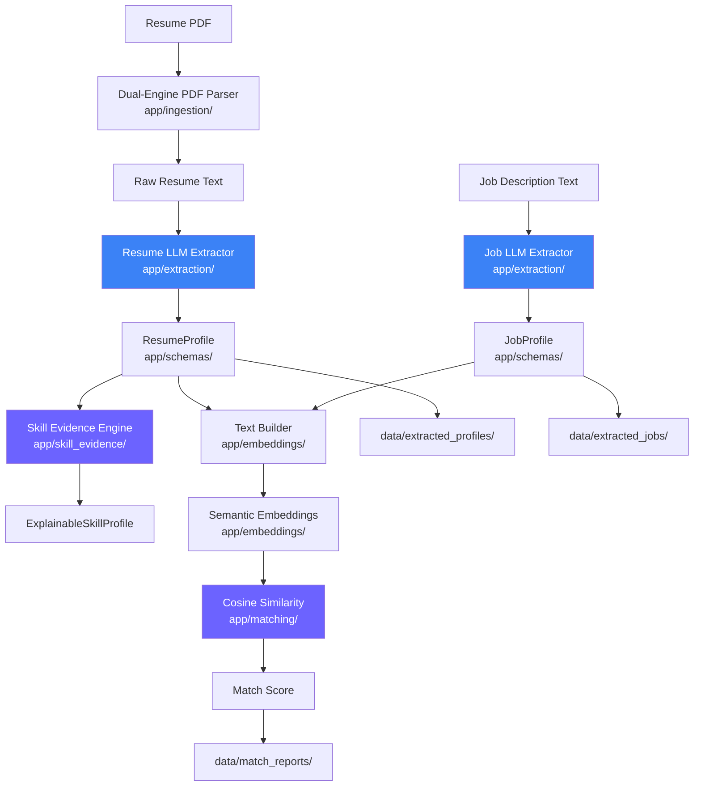

# AI Recruitment Intelligence System (ARIS)

A production-ready, AI-driven recruitment intelligence system built in Python. ARIS transforms unstructured PDF resumes and raw job descriptions into structured intelligence assets, computes semantic match scores, and produces explainable skill evidence profiles — all orchestrated through a single, clean pipeline API.

---

## Table of Contents
- [Features](#features)
- [System Architecture](#system-architecture)
- [Pipeline Stages](#pipeline-stages)
- [Project Directory Structure](#project-directory-structure)
- [Setup & Installation](#setup--installation)
- [Usage](#usage)
  - [Full Pipeline via Orchestrator (Recommended)](#full-pipeline-via-orchestrator-recommended)
  - [Individual Stage Scripts](#individual-stage-scripts)
  - [Programmatic API](#programmatic-api)
- [Data Schemas](#data-schemas)
- [Extraction Quality Rules](#extraction-quality-rules)
- [Error Handling](#error-handling)
- [Running Tests](#running-tests)

---

## Features

- **Central Orchestrator**: A single `RecruitmentOrchestrator.run()` call executes the complete pipeline — no manual script chaining required.
- **Dual-Engine PDF Parsing**: Uses `pdfplumber` and `PyMuPDF (fitz)` concurrently, selecting the cleanest output via an alphanumeric-to-character quality score.
- **LLM-Powered Extraction**: Integrates with Google Gemini API (`gemini-2.5-flash`) to extract structured candidate and job profiles from unstructured text.
- **Skill Knowledge Graph**: Builds a NetworkX directed graph from a skills taxonomy to expand and infer implicit candidate skills.
- **Skill Evidence Engine**: Produces `ExplainableSkillProfile` objects with weighted evidence chains, attribution sources, and tier classifications.
- **Semantic Matching**: Generates vector embeddings via local SentenceTransformer (`all-mpnet-base-v2`) and computes cosine similarity match scores.
- **Structured Persistence**: Saves validated Pydantic profiles and timestamped match reports as pretty-printed JSON files.
- **Comprehensive Logging**: All stages log to both stdout and `logs/aris.log`.

---

## System Architecture


```mermaid
graph TD
    A[Resume PDF] --> B[Dual-Engine PDF Parser\napp/ingestion/]
    B --> C[Raw Resume Text]
    C --> D[Resume LLM Extractor\napp/extraction/]
    D --> E[ResumeProfile\napp/schemas/]
    
    F[Job Description Text] --> G[Job LLM Extractor\napp/extraction/]
    G --> H[JobProfile\napp/schemas/]

    E --> I[Skill Evidence Engine\napp/skill_evidence/]
    I --> J[ExplainableSkillProfile]

    E --> K[Text Builder\napp/embeddings/]
    H --> K
    K --> L[Semantic Embeddings\napp/embeddings/]
    L --> M[Cosine Similarity\napp/matching/]
    M --> N[Match Score]

    E --> O[data/extracted_profiles/]
    H --> P[data/extracted_jobs/]
    N --> Q[data/match_reports/]

    style I fill:#6c63ff,color:#fff
    style M fill:#6c63ff,color:#fff
    style D fill:#3b82f6,color:#fff
    style G fill:#3b82f6,color:#fff
```

---

## Pipeline Stages

| Stage | Name | Description | Key Module |
|:---:|:---|:---|:---|
| **1** | **PDF Ingestion** | Extracts layout-preserving text from PDFs using dual engines (pdfplumber + PyMuPDF), selecting the higher quality output. | [`app/ingestion/resume_parser.py`](app/ingestion/resume_parser.py) |
| **2** | **Resume Extraction** | Submits parsed text to Gemini API, extracts structured candidate fields, validates against Pydantic schema. | [`app/extraction/resume_extractor.py`](app/extraction/resume_extractor.py) |
| **3** | **Job Extraction** | Processes raw job descriptions via Gemini, extracting explicit/implicit requirements and hidden hiring signals. | [`app/extraction/job_extractor.py`](app/extraction/job_extractor.py) |
| **4** | **Skill Knowledge Graph** | Builds a NetworkX directed skill graph from a taxonomy JSON to infer implicit candidate skills. | [`app/knowledge_graph/`](app/knowledge_graph/) |
| **5** | **Skill Evidence Engine** | Analyses a ResumeProfile through multi-source evidence collection, dependency expansion, project inheritance, and produces explainable skill profiles. | [`app/skill_evidence/`](app/skill_evidence/) |
| **6** | **Semantic Matching** | Compiles profiles into semantic text, generates local embeddings, and computes cosine similarity. | [`app/matching/`](app/matching/), [`app/embeddings/`](app/embeddings/) |

---

## Project Directory Structure

```
AI-RECRUITMENT-MODEL/
├── app/
│   ├── core/                            # Shared foundation layer
│   │   ├── config.py                    # Environment & API key configuration
│   │   ├── logging_setup.py             # Centralised logging initialisation
│   │   └── exceptions.py               # Shared exception base classes
│   │
│   ├── ingestion/                       # Stage 1 — Document parsing
│   │   └── resume_parser.py             # Dual-engine PDF text extractor
│   │
│   ├── extraction/                      # Stage 2 & 3 — LLM extraction
│   │   ├── resume_extractor.py          # Candidate profile LLM extraction service
│   │   └── job_extractor.py             # Job description LLM extraction service
│   │
│   ├── schemas/                         # Pydantic data contracts
│   │   ├── resume_schema.py             # ResumeProfile, Experience, Project, etc.
│   │   └── job_schema.py                # JobProfile, HiddenHiringSignals, etc.
│   │
│   ├── prompts/                         # LLM system & user prompts
│   │   ├── extraction_prompt.py         # Resume extraction prompts
│   │   └── job_prompt.py                # Job description extraction prompts
│   │
│   ├── knowledge_graph/                 # Stage 4 — Skill graph
│   │   ├── repositories/                # NetworkX graph data layer
│   │   ├── services/                    # SkillGraphService (query API)
│   │   ├── inference/                   # SkillInferenceEngine
│   │   ├── models.py                    # SkillNode data model
│   │   └── exceptions.py               # Graph-specific exceptions
│   │
│   ├── skill_evidence/                  # Stage 5 — Skill Evidence Engine
│   │   ├── engines/                     # Sub-engines (collection, dependency, inheritance, aggregation)
│   │   ├── graph/                       # ISkillGraphAdapter interface
│   │   ├── models/                      # Evidence data models (ExplainableSkillProfile, etc.)
│   │   ├── scoring/                     # EvidenceScorer, TierClassifier
│   │   └── services/                    # SkillEvidenceEngine (main orchestrator), factory
│   │
│   ├── experience_analysis/             # Experience scoring helpers
│   │   ├── complexity_calculator.py     # Project/role complexity scoring
│   │   ├── confidence_calculator.py     # Skill confidence level calculator
│   │   ├── evidence_collector.py        # Direct evidence collection from profiles
│   │   ├── signal_calculator.py         # Experience signal strength scoring
│   │   ├── skill_confidence_engine.py   # Confidence engine orchestrator
│   │   └── models.py                    # SkillEvidence, SkillConfidenceProfile
│   │
│   ├── embeddings/                      # Stage 6 — Embedding generation
│   │   ├── embedding_generator.py       # Local SentenceTransformer embedding generator
│   │   ├── embedder.py                  # Gemini API-based embedding service
│   │   └── text_builder.py             # Profile-to-semantic-text compiler
│   │
│   ├── matching/                        # Stage 6 — Semantic similarity
│   │   └── semantic_matcher.py          # Cosine similarity engine (scikit-learn)
│   │
│   ├── storage/                         # Persistent storage layer
│   │   ├── profile_storage.py           # Saves ResumeProfile as JSON
│   │   └── job_storage.py               # Saves JobProfile as JSON
│   │
│   ├── utils/                           # Shared utilities
│   │   └── file_utils.py                # PDF path validation & parser exceptions
│   │
│   ├── orchestrator.py                  # ★ Central pipeline orchestrator
│   └── main.py                          # Legacy CLI shim (see scripts/ instead)
│
├── scripts/                             # Standalone run & demo scripts
│   ├── run_full_pipeline.py             # ★ Full end-to-end pipeline via orchestrator
│   ├── run_resume_pipeline.py           # Resume parsing + extraction only
│   ├── run_job_pipeline.py              # Job description extraction only
│   └── run_matching.py                  # Semantic matching on saved profiles
│
├── data/
│   ├── extracted_profiles/              # Saved candidate profile JSONs
│   ├── extracted_jobs/                  # Saved job profile JSONs
│   ├── skill_graph/                     # Skill taxonomy JSON files
│   └── match_reports/                   # Timestamped match result JSONs
│
├── tests/                               # Unit tests (115 tests, all passing)
│
├── sample_jds/                          # Sample job description text files
├── sample_resumes/                      # Sample resume PDF files
├── logs/                                # Runtime logs → aris.log
├── .env                                 # Local environment file (API keys)
├── requirements.txt                     # Python dependencies
└── README.md
```

---

## Setup & Installation

### 1. Create Virtual Environment
```bash
python -m venv .venv
```

### 2. Activate Virtual Environment
```bash
# macOS / Linux
source .venv/bin/activate

# Windows (PowerShell)
.venv\Scripts\Activate.ps1
```

### 3. Install Dependencies
```bash
pip install -r requirements.txt
```

### 4. Configure Environment Variables
```bash
cp .env.example .env
```
Edit `.env`:
```env
GEMINI_API_KEY=your_gemini_api_key_here
GEMINI_MODEL=gemini-2.5-flash
```

---

## Usage

### Full Pipeline via Orchestrator (Recommended)

The simplest way to run ARIS end-to-end is via the orchestrator script:

```bash
# Using default sample files
python scripts/run_full_pipeline.py

# Custom resume, JD and role name
python scripts/run_full_pipeline.py path/to/resume.pdf path/to/jd.txt "Senior Software Engineer"
```

**Expected output:**
```
================================================================================
       AI Recruitment Intelligence System (ARIS) — Full Pipeline
================================================================================
[*] Resume  : sample_resumes/resume1.pdf
[*] JD file : sample_jds/senior_software_engineer.txt
[*] Role    : role

================================================================================
  PIPELINE RESULTS
================================================================================
  Candidate          : NISHANT PRASAD
  Role               : role
  Semantic Score     : 0.5545  (55.45%)

  Resume Profile     : data/extracted_profiles/nishant_prasad.json
  Job Profile        : data/extracted_jobs/role.json
  Match Report       : data/match_reports/nishant_prasad__role__20260619_103000.json
================================================================================
```

---

### Individual Stage Scripts

Run individual pipeline stages in isolation:

```bash
# Parse a resume PDF and extract structured candidate profile
python scripts/run_resume_pipeline.py
python scripts/run_resume_pipeline.py path/to/resume.pdf

# Extract a structured job profile from a JD text file
python scripts/run_job_pipeline.py
python scripts/run_job_pipeline.py path/to/jd.txt "Role Name"

# Compute semantic similarity between saved profiles
python scripts/run_matching.py
python scripts/run_matching.py data/extracted_profiles/john.json data/extracted_jobs/engineer.json
```

---

### Programmatic API

Use the orchestrator directly from Python code:

```python
from app.core.logging_setup import setup_logging
from app.orchestrator import RecruitmentOrchestrator

setup_logging()

orchestrator = RecruitmentOrchestrator()

result = orchestrator.run(
    resume_pdf_path="sample_resumes/resume1.pdf",
    jd_text=open("sample_jds/senior_software_engineer.txt").read(),
    job_name="Senior Software Engineer",
)

print(f"Candidate : {result.candidate_name}")
print(f"Score     : {result.semantic_score:.4f} ({result.semantic_score * 100:.2f}%)")
print(f"Report    : {result.match_report_path}")
```

**`OrchestratorResult` fields:**

| Field | Type | Description |
|:---|:---|:---|
| `candidate_name` | `str` | Extracted candidate full name |
| `job_name` | `str` | Role label used for file naming |
| `resume_profile` | `ResumeProfile` | Validated candidate Pydantic profile |
| `job_profile` | `JobProfile` | Validated job Pydantic profile |
| `semantic_score` | `float` | Cosine similarity score [0.0 — 1.0] |
| `resume_profile_path` | `str` | Path to saved candidate JSON |
| `job_profile_path` | `str` | Path to saved job JSON |
| `match_report_path` | `str` | Path to saved match report JSON |

---

## Data Schemas

### Candidate Resume Schema ([`app/schemas/resume_schema.py`](app/schemas/resume_schema.py))

| Class | Key Fields |
|:---|:---|
| `ResumeProfile` | `name`, `skills[]`, `experience[]`, `projects[]`, `education[]`, `certifications[]`, `achievements[]` |
| `Experience` | `role`, `company`, `start_date`, `end_date`, `duration`, `description` |
| `Project` | `name`, `technologies[]`, `description` |
| `Certification` | `name`, `issuer`, `year` |
| `Education` | `degree`, `institution`, `field`, `graduation_year` |

### Job Profile Schema ([`app/schemas/job_schema.py`](app/schemas/job_schema.py))

| Class | Key Fields |
|:---|:---|
| `JobProfile` | `required_skills[]`, `preferred_skills[]`, `critical_skills[]`, `experience_required`, `education`, `leadership`, `seniority_level`, `responsibility_themes[]`, `domain_knowledge[]`, `soft_skills[]`, `tools_and_technologies[]`, `hidden_hiring_signals`, `role_complexity_score`, `future_potential_signals[]`, `job_summary` |
| `HiddenHiringSignals` | `autonomy_required`, `client_facing`, `research_oriented`, `innovation_focused`, `startup_environment`, `high_ownership` |

---

## Extraction Quality Rules

The Job Description Intelligence Engine enforces rigorous extraction boundaries:

- **The Golden Rule**: Every extracted data point must be an *Explicit Fact* (directly stated) or a *Supported Inference* (implied by multiple evidence sources). When evidence is insufficient, fields default to `null`, `[]`, or `false`. Accuracy is strictly favoured over completeness.
- **Skills Normalisation**: Extracted only if the exact term or a standard industry alias (e.g. `K8s` → `Kubernetes`, `TS` → `TypeScript`) appears in the source text.
- **People Leadership**: `leadership = true` only when there is direct evidence of managing, supervising, or mentoring people. Technical ownership is classified as `false`.
- **Hallucination Prevention**: Forbids outputting unmentioned technologies. If `OpenAI` is mentioned, competing models like `Anthropic` or `Gemini` are explicitly suppressed unless also mentioned.
- **Hidden Hiring Signal Triggers**:
  - `autonomy_required` → `"minimal supervision"`, `"work independently"`
  - `client_facing` → `"meetings with clients"`, `"present to customers"`
  - `innovation_focused` → `"prototype new solutions"`, `"develop novel approaches"`
  - `startup_environment` → `"fast-paced startup"`, `"wear multiple hats"`
  - `high_ownership` → `"own outcomes"`, `"end-to-end ownership"`

---

## Error Handling

### PDF Ingestion ([`app/utils/file_utils.py`](app/utils/file_utils.py), [`app/ingestion/resume_parser.py`](app/ingestion/resume_parser.py))
- `ResumeParserError` — base class for all parser errors
- `CorruptedPDFError` — malformed or invalid PDF structure
- `EmptyPDFError` — PDF with no extractable text content
- `EncryptedPDFError` — password-protected PDF

### Resume Extraction ([`app/extraction/resume_extractor.py`](app/extraction/resume_extractor.py))
- `EmptyResumeTextError` — empty input text
- `MissingAPIKeyError` — `GEMINI_API_KEY` not configured
- `GeminiAPIError` — Gemini API call failed
- `InvalidJSONResponseError` — model returned non-JSON response
- `ProfileValidationError` — Pydantic schema validation failed

### Job Extraction ([`app/extraction/job_extractor.py`](app/extraction/job_extractor.py))
- `EmptyJobTextError` — empty JD input text
- All other exceptions match resume extraction pattern above.

### Embedding & Matching
- `EmbeddingGenerationError` — local SentenceTransformer init or encode failed
- `SemanticMatchingError` — cosine similarity computation failed
- `EmbeddingError`, `GeminiAPIError` — API-based embedding failures

---

## Running Tests

```bash
# Run all 115 unit tests
pytest tests/ -v

# Run a specific test module
pytest tests/test_resume_parser.py -v
pytest tests/test_information_extractor.py -v
```

The test suite covers:
- PDF parsing (valid, empty, corrupted, encrypted, missing)
- LLM extraction (valid response, markdown fences, empty input, missing API key, API failure, invalid JSON, Pydantic validation failure)
- Skill knowledge graph (repository, service, inference engine)
- Skill evidence engine (collection, dependency expansion, project inheritance, scoring, tier classification, capability aggregation)
- Semantic matching (identical, orthogonal, similar vectors, validation errors)
- Embedding generation (local SentenceTransformer init, encode, error handling)
- Text builder (resume/job profile to semantic text conversion)
