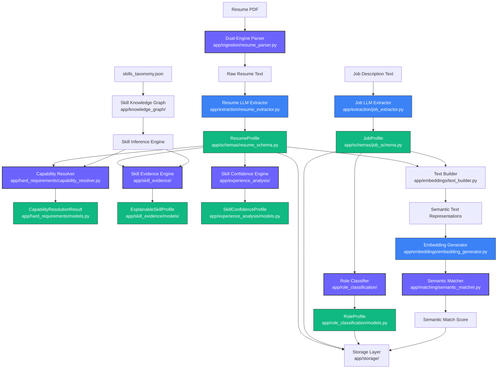

# AI Recruitment Intelligence System (ARIS)

ARIS is a production-ready, modular, and extensible AI-driven recruitment intelligence system built in Python. The platform transforms unstructured PDF resumes and raw job descriptions into structured intelligence assets, classifies roles into predefined industry taxonomies, constructs semantic evidence profiles, computes candidate experience signals, checks strict hard requirement compliance, and scores vector matches.

All components are wired into a central pipeline orchestrator or accessible through modular standalone engine APIs.

---

## Table of Contents
- [Quick Start](#quick-start)
- [Prerequisites](#prerequisites)
- [Platform Core Engines](#platform-core-engines)
  - [1. Dual-Engine PDF Ingestion](#1-dual-engine-pdf-ingestion)
  - [2. Pydantic-Schema LLM Extraction](#2-pydantic-schema-llm-extraction)
  - [3. Role Classification Engine](#3-role-classification-engine)
  - [4. Skill Knowledge Graph & Inference](#4-skill-knowledge-graph--inference)
  - [5. Skill Evidence Engine](#5-skill-evidence-engine)
  - [6. Experience Analysis & Skill Confidence Engine](#6-experience-analysis--skill-confidence-engine)
  - [7. Semantic Matching & Embeddings](#7-semantic-matching--embeddings)
  - [8. Hard Requirements Compliance Engine](#8-hard-requirements-compliance-engine)
- [System Architecture](#system-architecture)
- [Pipeline Stages](#pipeline-stages)
- [Project Directory Structure](#project-directory-structure)
- [Setup & Installation](#setup--installation)
- [Usage Instructions](#usage-instructions)
  - [Full Pipeline via Orchestrator](#full-pipeline-via-orchestrator)
  - [Individual Stage Run Scripts](#individual-stage-run-scripts)
  - [Phase 3 Validation Suite](#phase-3-validation-suite)
  - [Programmatic API](#programmatic-api)
- [Data Schemas](#data-schemas)
- [Extraction Quality & Prevention Rules](#extraction-quality--prevention-rules)
- [Custom Exception Hierarchy](#custom-exception-hierarchy)
- [Running Tests](#running-tests)
- [Troubleshooting](#troubleshooting)

---

## Quick Start

Run all commands from the **project root** (`AI-RECRUITMENT-MODEL/`).

```bash
# 1. Activate the workspace virtual environment
source ../.venv/bin/activate          # macOS / Linux
# ..\.venv\Scripts\Activate.ps1       # Windows (PowerShell)

# 2. Configure your environment variables (.env file)
# Create a .env file containing: GEMINI_API_KEY=your_key_here

# 3. Run the orchestrator with sample inputs
python scripts/run_full_pipeline.py
```

On first run, the local embedding model (`sentence-transformers/all-mpnet-base-v2`) is downloaded automatically. Subsequent runs are fully cached and take under 10 seconds.

---

## Prerequisites

| Requirement | Details |
|:---|:---|
| **Python** | 3.10 or newer recommended. (Python 3.9 is supported but raises deprecation warnings from Google API clients). |
| **Gemini API Key** | Required for structured profile extraction. Obtain one from the [Google AI Studio](https://aistudio.google.com/apikey). |
| **Dependencies** | Listed in [requirements.txt](file:///Users/navinprasad/aris/AI-RECRUITMENT-MODEL/requirements.txt) including `pdfplumber`, `PyMuPDF (fitz)`, `pydantic`, `sentence-transformers`, `scikit-learn`, `networkx`, and `pytest`. |

---

## Platform Core Engines

### 1. Dual-Engine PDF Ingestion
Located in [resume_parser.py](file:///Users/navinprasad/aris/AI-RECRUITMENT-MODEL/app/ingestion/resume_parser.py). It executes two parsers (`pdfplumber` and `PyMuPDF / fitz`) concurrently. It computes an alphanumeric-to-character density score for each output and retains the cleaner document structure. It handles corrupted, password-protected, and blank documents gracefully with tailored exceptions.

### 2. Pydantic-Schema LLM Extraction
Located in the [extraction](file:///Users/navinprasad/aris/AI-RECRUITMENT-MODEL/app/extraction) folder. Using Google Gemini (`gemini-2.5-flash`), it parses unstructured text into structured, typed payloads. The outputs are validated against strict contracts in [schemas](file:///Users/navinprasad/aris/AI-RECRUITMENT-MODEL/app/schemas) ensuring fields match explicit facts or supported inferences.

### 3. Role Classification Engine
Located in the [role_classification](file:///Users/navinprasad/aris/AI-RECRUITMENT-MODEL/app/role_classification) folder. It evaluates job description requirements against heuristic matrices in [role_rules.py](file:///Users/navinprasad/aris/AI-RECRUITMENT-MODEL/app/role_classification/role_rules.py). It classifies roles into standard Role Families (e.g. `software_engineering`, `data_ai`), specializations (e.g. `backend_engineer`, `ml_engineer`), and seniority levels (`junior`, `mid_level`, `senior`, `staff`).

### 4. Skill Knowledge Graph & Inference
Located in the [knowledge_graph](file:///Users/navinprasad/aris/AI-RECRUITMENT-MODEL/app/knowledge_graph) folder. Loads a skills taxonomy from `data/skill_graph/skills_taxonomy.json` into a `NetworkX` directed graph. It maps relationships (e.g. `FastAPI` -> `requires` -> `Python`). The [skill_inference_engine.py](file:///Users/navinprasad/aris/AI-RECRUITMENT-MODEL/app/knowledge_graph/inference/skill_inference_engine.py) performs ancestral traversal to infer implicit skills.

### 5. Skill Evidence Engine
Located in the [skill_evidence](file:///Users/navinprasad/aris/AI-RECRUITMENT-MODEL/app/skill_evidence) folder. Collects direct mentions, mapped project usages, role references, and graph dependencies for candidate skills. It assigns weighted attributions (Direct: 1.0, Project: 0.8, Dependency: 0.5, Inherited: 0.3) to construct trace chains and qualitative evidence levels (`Expert`, `Strong`, `Moderate`, `Limited`).

### 6. Experience Analysis & Skill Confidence Engine
Located in the [experience_analysis](file:///Users/navinprasad/aris/AI-RECRUITMENT-MODEL/app/experience_analysis) folder. Calculates job complexity scores based on duration and projects. It combines direct evidence, role descriptions, and project tenures to compute numerical confidence scores (0-100) and confidence tiers.

### 7. Semantic Matching & Embeddings
Located in the [matching](file:///Users/navinprasad/aris/AI-RECRUITMENT-MODEL/app/matching) and [embeddings](file:///Users/navinprasad/aris/AI-RECRUITMENT-MODEL/app/embeddings) folders. Resolves parsed candidate profiles and job criteria into cohesive text structures. It generates vector embeddings locally using `SentenceTransformer` (`all-mpnet-base-v2`) and computes cosine similarity match scores.

### 8. Hard Requirements Compliance Engine
Located in the [hard_requirements](file:///Users/navinprasad/aris/AI-RECRUITMENT-MODEL/app/hard_requirements) folder. Resolves raw candidate skills to canonical definitions. It expands candidate capabilities with inferred ancestors from the Skill Knowledge Graph while tracking exact graph origins. It strictly matches resolved capabilities against job criteria to return pass status, coverage score, matched/missing requirements, and granular decision reasons.

---

## System Architecture


```mermaid
graph TD
    %% Inputs
    Resume[Resume PDF] --> Ingestion[Dual-Engine Parser\napp/ingestion/resume_parser.py]
    Ingestion --> RawResumeText[Raw Resume Text]
    
    JD[Job Description Text] --> JobExtractor[Job LLM Extractor\napp/extraction/job_extractor.py]
    RawResumeText --> ResumeExtractor[Resume LLM Extractor\napp/extraction/resume_extractor.py]
    
    %% Outputs of Extractor
    ResumeExtractor --> ResumeProfile[ResumeProfile\napp/schemas/resume_schema.py]
    JobExtractor --> JobProfile[JobProfile\napp/schemas/job_schema.py]
    
    %% Classification
    JobProfile --> RoleClassifier[Role Classifier\napp/role_classification/]
    RoleClassifier --> RoleProfile[RoleProfile\napp/role_classification/models.py]
    
    %% Knowledge Graph & Inference
    Taxonomy[skills_taxonomy.json] --> Graph[Skill Knowledge Graph\napp/knowledge_graph/]
    Graph --> Inference[Skill Inference Engine]
    
    %% Hard Requirements Matching (Phase 5)
    ResumeProfile --> CapResolver[Capability Resolver\napp/hard_requirements/capability_resolver.py]
    Inference --> CapResolver
    CapResolver --> CapResult[CapabilityResolutionResult\napp/hard_requirements/models.py]
    
    %% Skill Evidence Engine
    ResumeProfile --> EvidenceEngine[Skill Evidence Engine\napp/skill_evidence/]
    Inference --> EvidenceEngine
    EvidenceEngine --> ExplainableProfile[ExplainableSkillProfile\napp/skill_evidence/models/]
    
    %% Experience Analysis & Skill Confidence Engine
    ResumeProfile --> ConfidenceEngine[Skill Confidence Engine\napp/experience_analysis/]
    ConfidenceEngine --> ConfidenceProfile[SkillConfidenceProfile\napp/experience_analysis/models.py]
    
    %% Semantic Matching
    ResumeProfile --> TextBuilder[Text Builder\napp/embeddings/text_builder.py]
    JobProfile --> TextBuilder
    TextBuilder --> SemanticText[Semantic Text Representations]
    SemanticText --> Embedder[Embedding Generator\napp/embeddings/embedding_generator.py]
    Embedder --> Matcher[Semantic Matcher\napp/matching/semantic_matcher.py]
    Matcher --> SemanticScore[Semantic Match Score]
    
    %% Persistence
    ResumeProfile --> Storage[Storage Layer\napp/storage/]
    JobProfile --> Storage
    RoleProfile --> Storage
    SemanticScore --> Storage
    
    %% Formatting
    classDef main fill:#6c63ff,color:#fff,stroke:#333,stroke-width:2px;
    classDef module fill:#3b82f6,color:#fff,stroke:#333,stroke-width:1px;
    classDef data fill:#10b981,color:#fff,stroke:#333,stroke-width:1px;
    
    class Ingestion,RoleClassifier,EvidenceEngine,ConfidenceEngine,CapResolver,Matcher main;
    class ResumeExtractor,JobExtractor,Embedder module;
    class ResumeProfile,JobProfile,RoleProfile,ExplainableProfile,ConfidenceProfile,CapResult data;
```

---

## Pipeline Stages

The central orchestrator in [orchestrator.py](file:///Users/navinprasad/aris/AI-RECRUITMENT-MODEL/app/orchestrator.py) executes the pipeline in 8 sequential stages:

| Stage | Name | Description | Responsible Module |
|:---:|:---|:---|:---|
| **1** | **PDF Ingestion** | Extracts text from PDFs using concurrent dual engines (`pdfplumber` + `PyMuPDF`). | [resume_parser.py](file:///Users/navinprasad/aris/AI-RECRUITMENT-MODEL/app/ingestion/resume_parser.py) |
| **2** | **Resume LLM Extraction** | Extracts structured fields via Gemini and compiles them into a verified Pydantic model. | [resume_extractor.py](file:///Users/navinprasad/aris/AI-RECRUITMENT-MODEL/app/extraction/resume_extractor.py) |
| **3** | **Job LLM Extraction** | Extracts explicit requirements, hidden signals, and complexity metrics from Job Descriptions. | [job_extractor.py](file:///Users/navinprasad/aris/AI-RECRUITMENT-MODEL/app/extraction/job_extractor.py) |
| **4** | **Role Classification** | Evaluates the job profile heuristics to detect role family, specialization, and seniority. | [role_classifier.py](file:///Users/navinprasad/aris/AI-RECRUITMENT-MODEL/app/role_classification/role_classifier.py) |
| **5** | **Text Compilation** | Builds detailed, structured semantic text profiles from extracted candidate and job fields. | [text_builder.py](file:///Users/navinprasad/aris/AI-RECRUITMENT-MODEL/app/embeddings/text_builder.py) |
| **6** | **Vector Embedding** | Generates normalized dense vector embeddings using a local SentenceTransformer model. | [embedding_generator.py](file:///Users/navinprasad/aris/AI-RECRUITMENT-MODEL/app/embeddings/embedding_generator.py) |
| **7** | **Semantic Matching** | Computes the cosine similarity between candidate and job profile vector representations. | [semantic_matcher.py](file:///Users/navinprasad/aris/AI-RECRUITMENT-MODEL/app/matching/semantic_matcher.py) |
| **8** | **Persistence** | Saves the parsed candidate profiles, job profiles, and similarity reports into structured storage. | [storage](file:///Users/navinprasad/aris/AI-RECRUITMENT-MODEL/app/storage) |

---

## Project Directory Structure

```
AI-RECRUITMENT-MODEL/
├── app/
│   ├── core/                                      # Shared foundation layer
│   │   ├── config.py                              # Environment configs & API keys
│   │   ├── logging_setup.py                       # Unified system logger setup
│   │   └── exceptions.py                          # Core domain base exceptions
│   │
│   ├── ingestion/                                 # Stage 1 — Ingestion parsing
│   │   └── resume_parser.py                       # Concurrent dual-engine PDF extractor
│   │
│   ├── extraction/                                # Stage 2 & 3 — LLM semantic extraction
│   │   ├── resume_extractor.py                    # Candidate resume extraction engine
│   │   └── job_extractor.py                       # Job description extraction engine
│   │
│   ├── schemas/                                   # Pydantic schema schemas
│   │   ├── resume_schema.py                       # Candidate profile structure contract
│   │   └── job_schema.py                          # Job profile structure contract
│   │
│   ├── prompts/                                   # Prompt template files
│   │   ├── extraction_prompt.py                   # Resume LLM extraction rules
│   │   └── job_prompt.py                          # Job description extraction rules
│   │
│   ├── role_classification/                       # Stage 4 — Domain classification
│   │   ├── models.py                              # RoleProfile definitions
│   │   ├── exceptions.py                          # Classifier exception classes
│   │   ├── role_rules.py                          # Mapping matrices & heuristics
│   │   └── role_classifier.py                     # Heuristics evaluation engine
│   │
│   ├── knowledge_graph/                           # Stage 5 — Skills graph & inferences
│   │   ├── repositories/
│   │   │   └── networkx_repository.py             # NetworkX taxonomy layer
│   │   ├── services/
│   │   │   └── skill_graph_service.py             # Graph queries service
│   │   ├── inference/
│   │   │   └── skill_inference_engine.py          # Ancestor skill inference resolver
│   │   ├── models.py                              # SkillNode structures
│   │   └── exceptions.py                          # Graph specific exceptions
│   │
│   ├── skill_evidence/                            # Stage 6 — Evidence chains
│   │   ├── engines/                               # Sub-engines (dependency, aggregation)
│   │   ├── graph/                                 # Graph schema adapters
│   │   ├── models/
│   │   │   └── evidence_models.py                 # Trace source & ExplainableSkillProfile
│   │   ├── scoring/                               # EvidenceScorer, TierClassifier
│   │   └── services/                              # Orchestrator services & factories
│   │
│   ├── experience_analysis/                       # Experience heuristics engine
│   │   ├── complexity_calculator.py               # Evaluates role complexity
│   │   ├── confidence_calculator.py               # Generates skill confidence
│   │   ├── evidence_collector.py                  # Collects raw experience signals
│   │   ├── signal_calculator.py                   # Analyzes project/role duration
│   │   ├── skill_confidence_engine.py             # Confidence analysis orchestrator
│   │   └── models.py                              # SkillConfidenceProfile
│   │
│   ├── hard_requirements/                         # Strict compliance matching
│   │   ├── models.py                              # HardRequirementResult & CapabilityResolutionResult
│   │   ├── exceptions.py                          # Compliance exception classes
│   │   └── capability_resolver.py                 # Resolves explicit/inferred skill matches
│   │
│   ├── embeddings/                                # Embeddings generation
│   │   ├── embedding_generator.py                 # Local SentenceTransformer generator
│   │   ├── embedder.py                            # LLM API embedding generator wrapper
│   │   └── text_builder.py                        # Compiler for semantic matching text
│   │
│   ├── matching/                                  # Cosine similarities
│   │   └── semantic_matcher.py                    # Scikit-learn matcher engine
│   │
│   ├── storage/                                   # Persistence layer
│   │   ├── job_storage.py                         # Saves JobProfile structures to file
│   │   └── profile_storage.py                     # Saves ResumeProfile structures to file
│   │
│   ├── utils/                                     # Utility layer
│   │   └── file_utils.py                          # File validations and assertions
│   │
│   ├── orchestrator.py                            # Central pipeline orchestrator
│   └── main.py                                    # CLI execution entry point shim
│
├── scripts/                                       # Independent execution scripts
│   ├── run_full_pipeline.py                       # Orchestrated end-to-end pipeline script
│   ├── run_resume_pipeline.py                     # Parse + Extract resume pipeline script
│   ├── run_job_pipeline.py                        # Parse + Extract job description script
│   └── run_matching.py                            # Matches stored JSON assets
│
├── data/                                          # Output assets (runtime generated)
│   ├── extracted_profiles/                        # Saved candidate json profiles
│   ├── extracted_jobs/                            # Saved job description profiles
│   ├── skill_graph/                               # Taxonomy mapping definitions
│   │   └── skills_taxonomy.json                   # Master NetworkX taxonomy schema
│   └── match_reports/                             # Vector score report outputs
│
├── tests/                                         # Project-wide unit tests directory
│   ├── test_capability_resolver.py                # Verifies skill graph compliance resolver
│   ├── test_complexity_calculator.py              # Verifies experience complexity math
│   ├── test_confidence_calculator.py              # Verifies confidence level thresholds
│   ├── test_embedder.py                           # Verifies API embeddings wrapper
│   ├── test_embedding_generator.py                # Verifies local transformers embedding
│   ├── test_evidence_collector.py                 # Verifies experience signals aggregator
│   ├── test_experience_analysis_models.py          # Verifies experience structures
│   ├── test_hard_requirements_models.py           # Verifies requirement compliance schemas
│   ├── test_information_extractor.py              # Verifies resume extraction mock tests
│   ├── test_job_extractor.py                      # Verifies job description parser tests
│   ├── test_orchestrator.py                       # Verifies full orchestrator pipelines
│   ├── test_resume_parser.py                      # Verifies concurrent parser engine fallback
│   ├── test_role_classification.py                # Verifies heuristics classifier rules
│   ├── test_semantic_matcher.py                   # Verifies cosine math calculations
│   ├── test_signal_calculator.py                  # Verifies signal weighting math
│   ├── test_skill_confidence_engine.py            # Verifies skill scoring metrics
│   ├── test_skill_graph_repository.py             # Verifies NetworkX database operations
│   ├── test_skill_graph_service.py                # Verifies graph traversal methods
│   ├── test_skill_inference_engine.py             # Verifies ancestral expansion rules
│   └── test_text_builder.py                       # Verifies compiler serialization
│
├── sample_jds/                                    # Raw job description test cases
├── sample_resumes/                                # Raw PDF resume test cases
├── logs/                                          # System diagnostic logs output
├── requirements.txt                               # Explicit package configuration
└── phase3.py                                      # Classification validation suite
```

---

## Setup & Installation

### 1. Set Up Virtual Environment
ARIS relies on a workspace virtual environment. Activate it before executing pipelines:
```bash
# Verify your directory is the project root (AI-RECRUITMENT-MODEL/)
# Activate the environment:
source ../.venv/bin/activate
```

### 2. Configure Local Settings
Dependencies are installed within this environment. Review packages in [requirements.txt](file:///Users/navinprasad/aris/AI-RECRUITMENT-MODEL/requirements.txt):
```bash
pip install -r requirements.txt
```

### 3. Set Up API Key
Create a `.env` file in the project root to load API keys securely:
```env
# Gemini Credentials
GEMINI_API_KEY=your_key_here
GEMINI_MODEL=gemini-2.5-flash
```

The system loader [config.py](file:///Users/navinprasad/aris/AI-RECRUITMENT-MODEL/app/core/config.py) automatically processes these parameters. Real shell environment variables will override `.env` parameters if specified.

---

## Usage Instructions

### Full Pipeline via Orchestrator
Execute the entire pipeline (Ingestion through Similarity Persisting) using default sample assets:
```bash
python scripts/run_full_pipeline.py
```

Pass customized command arguments to evaluate target candidates:
```bash
python scripts/run_full_pipeline.py path/to/resume.pdf path/to/job_desc.txt "Custom Job Name"
```

### Individual Stage Run Scripts
Run isolated components to debug or test specific pipeline slices:

```bash
# Parse + Extract resume PDF text to JSON profile only
python scripts/run_resume_pipeline.py path/to/resume.pdf

# Parse + Extract Job Description text files only
python scripts/run_job_pipeline.py path/to/jd.txt "Job Title"

# Compute semantic overlap on pre-extracted JSON targets
python scripts/run_matching.py path/to/candidate.json path/to/job.json
```

### Phase 3 Validation Suite
Execute the rule classification verification suite directly. This tests the classifier heuristics against a predefined set of 12 distinct role test cases:
```bash
python phase3.py
```

### Programmatic API
Orchestrate ARIS inside your applications using python scripts:
```python
from app.core.logging_setup import setup_logging
from app.orchestrator import RecruitmentOrchestrator

# Setup system logs
setup_logging()

# Run the orchestator
orchestrator = RecruitmentOrchestrator()
result = orchestrator.run(
    resume_pdf_path="sample_resumes/resume1.pdf",
    jd_text="Looking for a Senior Python Developer with AWS experience.",
    job_name="Senior Python Developer"
)

print(f"Candidate: {result.candidate_name}")
print(f"Match: {result.semantic_score * 100:.2f}%")
print(f"Role Specialization: {result.role_profile.specialization}")
print(f"Match Profile: {result.match_report_path}")
```

---

## Data Schemas

### Resume Profile
Defined in [resume_schema.py](file:///Users/navinprasad/aris/AI-RECRUITMENT-MODEL/app/schemas/resume_schema.py). Represents extracted candidate details:
* `name`: Full name of candidate.
* `skills`: List of explicit skills declarations.
* `experience`: List of professional records (role, company, duration, description).
* `projects`: List of completed projects (name, technologies used, descriptions).
* `education`: List of degrees (degree, institution, field, graduation year).
* `certifications`: Extracted certifications (name, issuer, year).

### Job Profile
Defined in [job_schema.py](file:///Users/navinprasad/aris/AI-RECRUITMENT-MODEL/app/schemas/job_schema.py). Represents job specifications:
* `title`: Official role title.
* `required_skills`: List of mandatory core skills.
* `preferred_skills`: List of nice-to-have supplementary skills.
* `critical_skills`: Highest priority requirements list.
* `experience_required`: Numeric tenure requirements.
* `seniority_level`: Classified target seniority.
* `hidden_hiring_signals`: Boolean fields (e.g. `startup_environment`, `high_ownership`).

### Role Profile
Defined in [models.py](file:///Users/navinprasad/aris/AI-RECRUITMENT-MODEL/app/role_classification/models.py). Contains structural details inferred by classifier rules:
* `role_family`: Broad field (e.g. `software_engineering`).
* `specialization`: Detailed job title (e.g. `backend_engineer`).
* `seniority`: Qualitative seniority level (e.g. `mid_level`).
* `evaluation_profile`: Composite target identifier (e.g. `mid_backend`).

### Hard Requirements compliance Result
Defined in [models.py](file:///Users/navinprasad/aris/AI-RECRUITMENT-MODEL/app/hard_requirements/models.py). Output of the compliance evaluation:
* `passed`: True if the candidate matched all critical required skills.
* `coverage_score`: Percentage of job requirements matched (0.0 to 1.0).
* `matched_required`: List of matched mandatory skills.
* `missing_required`: List of missing mandatory skills.
* `matched_preferred`: List of matched nice-to-have skills.
* `missing_preferred`: List of missing nice-to-have skills.
* `critical_failures`: Required skills whose absence triggered a compliance failure.
* `decision_reason`: Human-readable justification explanation.

### Capability Resolution Result
Defined in [models.py](file:///Users/navinprasad/aris/AI-RECRUITMENT-MODEL/app/hard_requirements/models.py). Output of the canonical skill graph mapping:
* `explicit_skills`: Cleaned, canonicalized candidate skills list.
* `inferred_skills`: Traversal inferred parent/ancestor skills.
* `candidate_capabilities`: Combined explicit and inferred list.
* `skill_origins`: Mapping details detailing source-to-ancestor paths.

---

## Extraction Quality & Prevention Rules

To preserve accuracy, ARIS enforces strict guidelines across its parsing pipelines:
* **The Golden Rule**: Every extracted data point must represent an *Explicit Fact* or *Supported Inference*. Default to `null`, `[]`, or `false` when evidence is insufficient.
* **No Technology Hallucination**: Do not introduce unmentioned libraries. For example, if a job description mentions `AWS`, do not extract `GCP` or `Azure` unless explicitly written.
* **Leadership Heuristics**: `leadership` is set to `true` only when the candidate has managed, supervised, or mentored people. Technical project ownership is marked as `false`.
* **Signal Triggers**:
  * `autonomy_required` matches `"minimal supervision"`, `"self-starter"`, `"work independently"`.
  * `startup_environment` matches `"fast-paced startup"`, `"dynamic env"`, `"multiple hats"`.
  * `high_ownership` matches `"end-to-end ownership"`, `"own outcomes"`.

---

## Custom Exception Hierarchy

All system processes use a unified, descriptive hierarchy inheriting from `ARISError` for clean diagnostics:

```
Exception (Python Built-in)
 └── ARISError (app.core.exceptions)
      ├── MissingAPIKeyError (app.core.exceptions)
      ├── GeminiAPIError (app.core.exceptions)
      ├── InvalidJSONResponseError (app.core.exceptions)
      ├── ProfileValidationError (app.core.exceptions)
      │
      ├── ResumeParserError (app.ingestion.resume_parser)
      │    ├── CorruptedPDFError (app.utils.file_utils)
      │    ├── EmptyPDFError (app.utils.file_utils)
      │    └── EncryptedPDFError (app.utils.file_utils)
      │
      ├── ResumeExtractionError (app.extraction.resume_extractor)
      │    └── EmptyResumeTextError (app.extraction.resume_extractor)
      │
      ├── JobExtractionError (app.extraction.job_extractor)
      │    └── EmptyJobTextError (app.extraction.job_extractor)
      │
      ├── RoleClassificationError (app.role_classification.exceptions)
      │    ├── RoleFamilyDetectionError (app.role_classification.exceptions)
      │    ├── SpecializationDetectionError (app.role_classification.exceptions)
      │    └── SeniorityDetectionError (app.role_classification.exceptions)
      │
      ├── HardRequirementError (app.hard_requirements.exceptions)
      │    ├── CapabilityResolutionError (app.hard_requirements.exceptions)
      │    ├── RequirementMatchingError (app.hard_requirements.exceptions)
      │    └── CoverageEvaluationError (app.hard_requirements.exceptions)
      │
      ├── EmbeddingError (app.embeddings.embedder)
      │    └── EmbeddingGenerationError (app.embeddings.embedding_generator)
      │
      └── SemanticMatchingError (app.matching.semantic_matcher)

 SkillGraphError (app.knowledge_graph.exceptions)
  └── GraphInitializationError (app.knowledge_graph.exceptions)
       ├── DuplicateNodeError (app.knowledge_graph.exceptions)
       └── MissingNodeReferenceError (app.knowledge_graph.exceptions)
```

---

## Running Tests

Verify all components are working correctly using pytest. Use `python -m pytest` or set `PYTHONPATH` before executing to ensure module imports are resolved:

```bash
# Run all tests (240+ cases covered)
python -m pytest tests/ -v

# Alternatively, set the PYTHONPATH explicitly
PYTHONPATH=. pytest tests/ -v

# Run a specific subset of engine tests
PYTHONPATH=. pytest app/skill_evidence/tests/ -v
PYTHONPATH=. pytest tests/test_capability_resolver.py -v
```

---

## Troubleshooting

| Diagnostics Issue | Common Culprit | Suggested Resolution |
|:---|:---|:---|
| `ModuleNotFoundError: No module named 'app'` | Running pytest directly without setting the python import paths | Execute tests using `python -m pytest tests/` or set `PYTHONPATH=. pytest tests/`. |
| `MissingAPIKeyError` | `.env` variables cannot be read, or path settings are wrong | Ensure the `.env` file is in the root directory (`AI-RECRUITMENT-MODEL/`) and matches standard formats. |
| `Slow execution on first run` | SentenceTransformer is downloading the local model | The model `all-mpnet-base-v2` is roughly 420MB. Ensure you have internet access on first run; later executions load from local cache. |
| `EmptyPDFError` | The resume PDF has no selectable text (scanned image) | ARIS requires machine-readable PDFs. Run scanned PDFs through an OCR tool before parsing. |
| API quota limit issues | Gemini API key hit usage limit | Wait for the quota period to reset or configure a premium key in AI Studio. |
